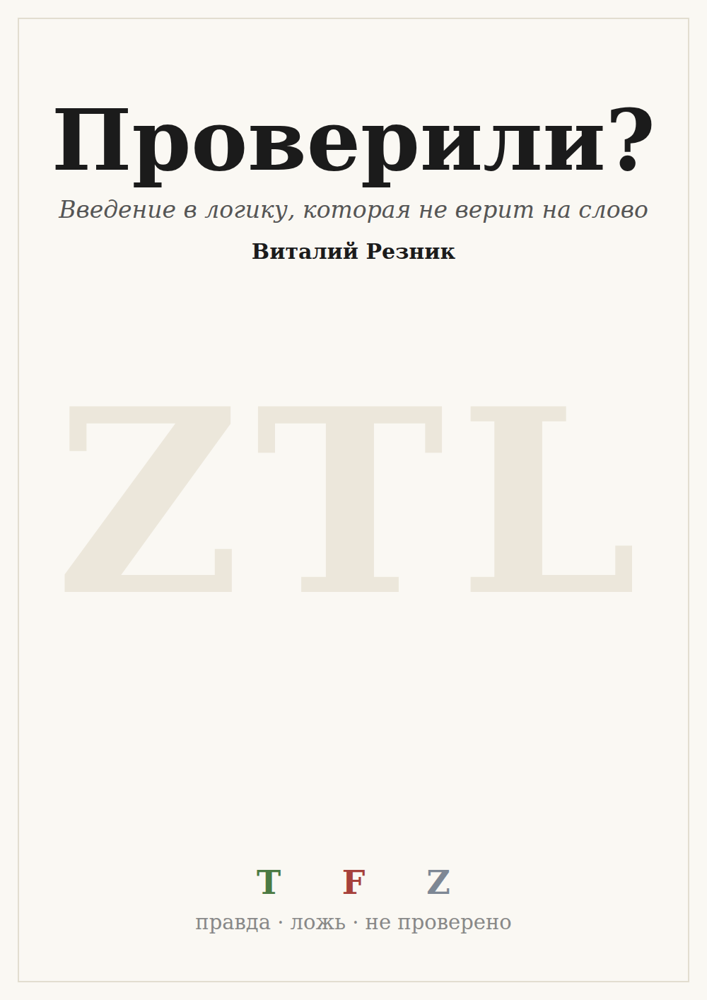

*Начинать можно примерно с шестого-седьмого класса; с учителем — раньше.
Верхнего предела нет.*

*И сразу первый пример того, как устроена эта книга: предыдущую строчку мы не
проверяли. Детей мы не спрашивали, это мнение автора, и оно помечено как
мнение.*

*Оговорка, без которой предыдущий абзац был бы хвастовством: разделы «что
известно точно» проверяют только формальные утверждения — про таблицы, теоремы
и числа. Всё, что в книге сказано про людей, про историю и про то, что читатель
найдёт у себя в тетради, — наблюдения автора, никем не измеренные, и их
десятки. Они не помечены поимённо, и это единственное место, где мы просим
верить на слово.*

---

## Как читать эту книгу

Шестнадцать глав, шесть частей. Каждая часть начинается словами о том, что от
читателя требуется, — и требуется всегда немного: сперва только умение спорить,
дальше умение прочесть таблицу, и лишь под конец логика как предмет.

В каждой главе есть раздел **«Что тут известно точно»**. Там отделено
доказанное от промеренного и от рассуждения. Если утверждение не помечено как
доказанное — оно не доказано, и так и написано.

В конце есть **приложение** — чужая тетрадь, заполненная от начала до конца: с
ошибками и с их исправлением, а следом та же тетрадь начисто, одним взглядом.
Если ты не станешь вести свою, прочти хотя бы её.

И в каждой главе есть **тетрадь**. Это не упражнение для галочки: тетрадь идёт
через всю книгу, обрастая колонками, и к последней странице в руках у читателя
оказывается не понятие, а привычка, которую он построил сам.

---

## Об авторстве

Логику ZTL разработал Виталий Резник. Эту книгу — её изложение «на пальцах» — он
задумал и вёл: ставил задачу, направлял, проверял каждую главу и был конечным
рецензентом; текст под его руководством написал ассистент Claude (Anthropic).
Формальные утверждения — таблицы, числа, теоремы — посчитаны из кода ZTL и
воспроизводимы; всё про людей и историю — наблюдения автора, как оговорено выше.
Участие ИИ раскрыто здесь прямо — потому что книга ровно про то, чтобы не верить
на слово.

---
