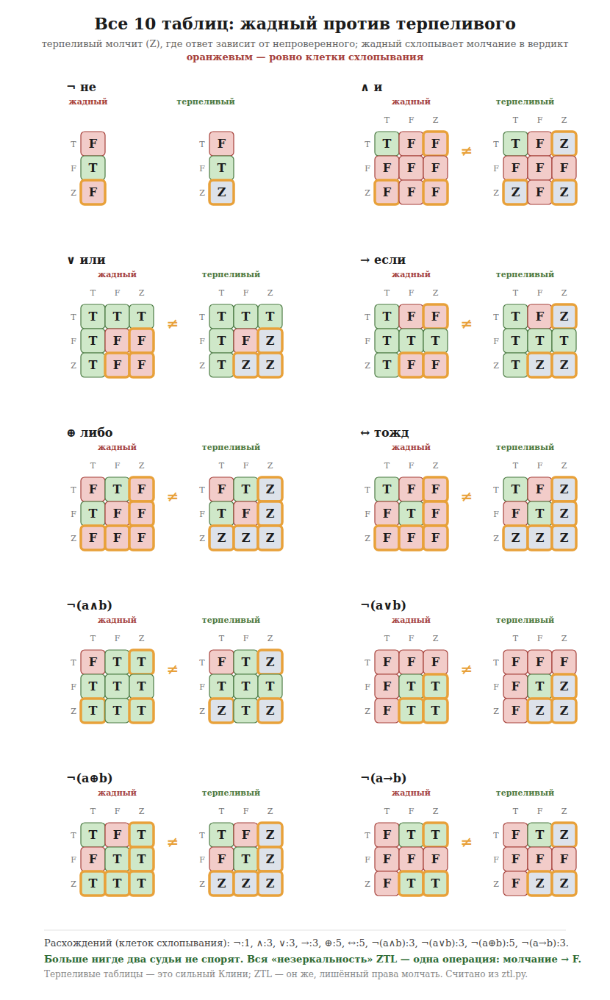

# Глава 9. Два судьи, и они спорят

*Нужно понимать функцию: правило, которое из входа делает выход.*

---

## Обещание, которое я давал

В пятой главе правило звучало так: истинно, если истинно при каждом раскладе
непроверенного. И тут же стояла оговорка, на которую легко было не обратить
внимания: важно, **к чему** ты это правило применяешь — к целой формуле или к
каждому куску по отдельности.

Оговорка оказалась не мелочью. Из неё выходят два разных судьи.

## Считать по шагам или целиком

**Жадный считает ПО ШАГАМ.** Сперва самая внутренняя связка, потом наружу. На
каждом шаге спрашивает «при каждом ли раскладе?», получает готовое «да» или
«нет» — и дальше работает уже с ним.

**Терпеливый берёт формулу ЦЕЛИКОМ.** Перебирает расклады один раз, для всего
утверждения сразу, и смотрит, во всех ли оно верно.

Кажется, что разницы быть не должно. Она есть:

    при непроверенном p       по шагам      целиком
    ¬(p и не-p)                  верно        верно
    p или не-p                   НЕВЕРНО      верно
    если p, то p                 НЕВЕРНО      верно

Вторая строка — вот она, разница. По шагам судья сначала считает «не-p» и
получает «нет». И дальше работает уже с этим «нет», **забыв, что второе есть
отрицание того же самого p**. Связь между половинками потеряна.

Терпеливый её не терял: он перебирает расклады для всего сразу, и в каждом одна
половина истинна.

## И теперь главное: они спорят

Тут я обязан сказать вещь, которую в первой версии этой главы написал неверно, и
поправить себя вслух.

Я написал тогда: «они никогда не спорят». Это **неправда**, и опровергается она
таблицей тремя абзацами выше — той самой, что я сам же и напечатал.

Промерили: на двадцати трёх тысячах случаев двое расходятся в тысяче шестистах.
И расхождения бывают **двух разных родов**.

**ПОТЕРЯ.** Жадный говорит «нет», терпеливый — «верно». Тысяча двести
тридцать случаев. Это когда ответ один при любом исходе, а жадный этого не
видит, потому что считал по кускам. Обидно, но безопасно: мы отказали там, где
могли согласиться.

**ПОДАРОК.** Жадный говорит **«да»**, а терпеливый — «нет». Четыреста случаев.

Вот это уже не обидно, а серьёзно. Здесь машина, обещавшая не давать в кредит,
**даёт его**.

## Куда смотреть, чтобы увидеть утечку

Есть и третий случай, помимо потери и подарка, и он самый короткий: **двойное
отрицание**.

    ¬ от непроверенного        даёт «нет»
    ¬ от этого «нет»           даёт «ДА»

То есть «неверно, что неверно p» выходит **истинным** — при том, что p никто не
смотрел.

А теперь проверь p. Если окажется, что p ложно — «неверно, что неверно p» тоже
станет ложным. Заработанная истина **сгорает**.

Это и есть кредит, выданный машиной, которая обещала его не выдавать. Не
оговорка и не редкость: одна из самых коротких формул языка.

Строго говоря, это не «подарок» в смысле предыдущего раздела — там терпеливый
говорил «нет», а тут он молчит: при одном исходе выходит «да», при другом «нет».
Но результат тот же: жадный сказал «да» о непроверенном, и проверка это отменит.

И вот число, которое я обязан назвать, потому что оно против нас. Если считать
подарком **всякий** жадный «да», который проверка может отменить, — таких мест
**больше, чем потерь**. Не «реже и дороже», как я написал строчкой выше в первой
редакции, а чаще и дороже.

## Почему мы это не чиним

Первое желание — заклеить дырку: сделать так, чтобы двойное отрицание не давало
истины. Но за него держится вся остальная конструкция, и в четырнадцатой главе
мы увидим, что именно эта клетка отличает нашу логику от соседей.

Значит выбор был сделан, и сделан открыто: **мы приняли один подарок ради того,
чтобы всё остальное работало.** Не «у нас нет кредита» — а «кредит у нас ровно
один, вот он, вот его цена».

Книга, которая скрыла бы эту клетку, была бы книгой не про то, про что она.

## Кто из двоих настоящий

Судья, который считает по-настоящему, — **жадный**. Все таблицы пятой главы, весь
прайс-лист седьмой, все примеры — это он.

Терпеливый — не второй механизм, а **способ посмотреть на ту же формулу
сверху**: что было бы верно при любом исходе. Он полезен как проверка, но
вердиктов не выносит.

    жадный      выносит вердикт, отвечает всегда, может передумать
    терпеливый  вердиктов не выносит; показывает, что уцелеет при
                любом исходе, — и тем ловит подарки жадного

## Что тут известно точно

**Промерено:** двое расходятся в 1630 случаях из 23 118. Из них 1230 потерь и
400 подарков.

**Доказано:** существует формула, на которой жадный выдаёт «истинно», а проверка
это отменяет. Минимальный пример — двойное отрицание.

**Не утверждается:** что расхождения исчерпываются двумя родами. Мы нашли два;
не искали доказательства, что третьего нет.

**Забрано назад:** утверждение «они никогда не спорят» из первой редакции этой
главы. Оно было ложным, и опровергала его собственная таблица главы.

## Тетрадь

Возьми строку с непроверенным и ответь дважды.

Сначала по шагам, как жадный: считай изнутри наружу, получая на каждом шаге
готовый ответ.

Потом целиком, как терпеливый: перебери исходы для всего утверждения сразу.

Если ответы разошлись — посмотри, в какую сторону.

    жадный «нет», целиком «да»  —  потеря: ты отказал зря
    жадный «да», а проверка отменит  —  УТЕЧКА: ты поверил зря

Второе и чаще, и дороже. Найдёшь у себя — обведи.

И числа, чтобы это не было словами. Перебрали все утверждения глубины до двух на
трёх строчках — тринадцать тысяч штук, двадцать семь способов расставить пометки,
**двести сорок восемь тысяч случаев**. Из них:

    потери   14 844
    утечки   44 847

Утечек **втрое больше**, чем потерь. Это число не в нашу пользу, и потому оно
здесь.

А вот второе, и оно объясняет первое:

    потери при одном вхождении строчки        0
    утечки при одном вхождении строчки   16 023

Ни одной потери — ровно то, что обещано в пятой главе и доказано машиной. И
шестнадцать тысяч утечек там же. Двойное отрицание — одна из них.

Проверить самому: `python3 lab/losses/census.py` в нашем хранилище. Числа
печатает он, не я.

---

*В следующей главе — квитанция: почему судья обязан назвать, чего ему не
хватило, и что доказано об этом списке.*
