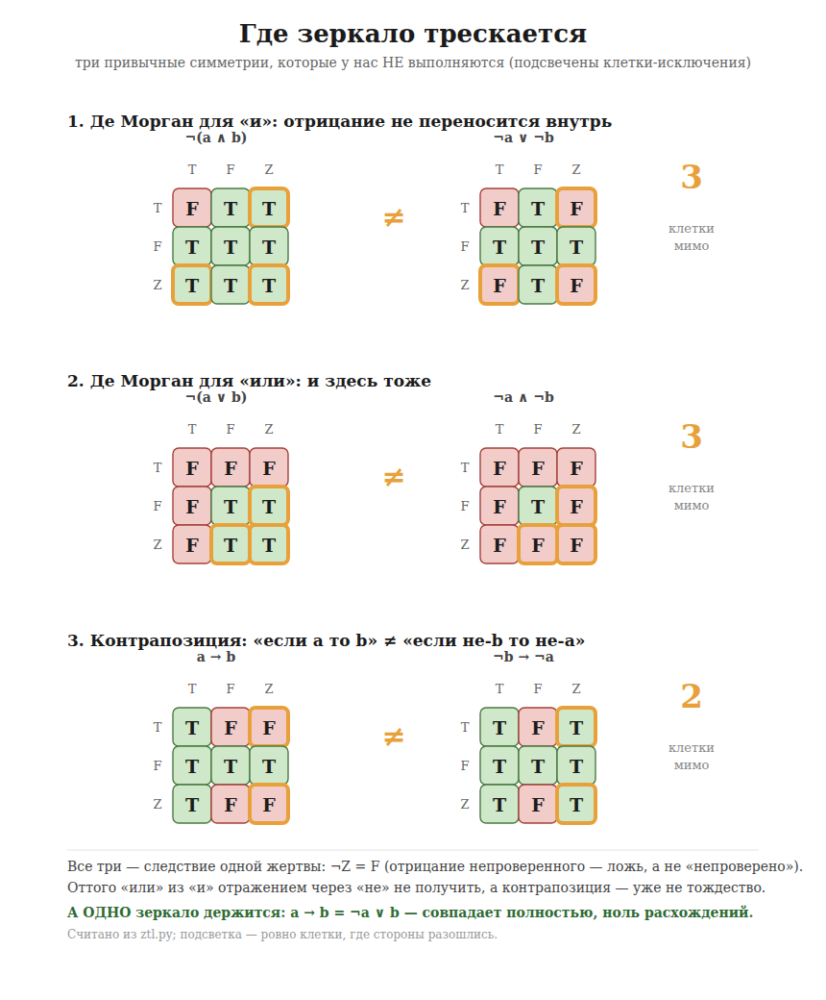

*Начинать можно примерно с шестого-седьмого класса; с учителем — раньше.
Верхнего предела нет.*

*И сразу первый пример того, как устроена эта книга: предыдущую строчку мы не
проверяли. Детей мы не спрашивали, это мнение автора, и оно помечено как
мнение.*

*Оговорка, без которой предыдущий абзац был бы хвастовством: разделы «что
известно точно» проверяют только формальные утверждения — про таблицы, теоремы
и числа. Всё, что в книге сказано про людей, про историю и про то, что читатель
найдёт у себя в тетради, — наблюдения автора, никем не измеренные, и их
десятки. Они не помечены поимённо, и это единственное место, где мы просим
верить на слово.*

---

## Как читать эту книгу

Шестнадцать глав, шесть частей. Каждая часть начинается словами о том, что от
читателя требуется, — и требуется всегда немного: сперва только умение спорить,
дальше умение прочесть таблицу, и лишь под конец логика как предмет.

В каждой главе есть раздел **«Что тут известно точно»**. Там отделено
доказанное от промеренного и от рассуждения. Если утверждение не помечено как
доказанное — оно не доказано, и так и написано.

В конце есть **приложение** — чужая тетрадь, заполненная от начала до конца: с
ошибками и с их исправлением, а следом та же тетрадь начисто, одним взглядом.
Если ты не станешь вести свою, прочти хотя бы её.

И в каждой главе есть **тетрадь**. Это не упражнение для галочки: тетрадь идёт
через всю книгу, обрастая колонками, и к последней странице в руках у читателя
оказывается не понятие, а привычка, которую он построил сам.

---

## Об авторстве

Эту книгу написал ИИ — ассистент Claude (Anthropic) — в связке с человеком:
Виталий Резник ставил задачу, направлял, проверял каждую главу и был конечным
рецензентом. Формальные утверждения — таблицы, числа, теоремы — посчитаны из
кода ZTL и воспроизводимы; всё про людей и историю — наблюдения автора, как
оговорено выше. Участие ИИ раскрыто здесь прямо — потому что книга ровно про то,
чтобы не верить на слово.

---

# ЧАСТЬ I. НУЖНО ТОЛЬКО УМЕТЬ СПОРИТЬ

---

# Глава 1. А проверили?

*Для этой главы не нужно ничего, кроме умения спорить.*

---

## Отказ без причины

Ты заполняешь форму. Долго, внимательно, всё по правилам. Нажимаешь
«Отправить». И получаешь: **«Заявка отклонена»**.

Почему? Не написано.

Или так. Приложение говорит: «Вход невозможен». Что именно невозможно —
пароль не тот, интернет пропал, тебя забанили? Молчание.

Или совсем просто. Ты говоришь дома: «Я сделал уроки». Тебе отвечают: «Не
верю». Ты спрашиваешь: «А что не так?» И слышишь: «Просто не верю».

Три разных случая, и во всех троих одно и то же чувство. Не обида от того,
что тебе сказали «нет». Обида от того, что **тебе не сказали, чего не
хватило**.

Заметь: если бы форма написала «не хватает второй страницы паспорта» — ты бы
не злился. Ты бы пошёл и принёс вторую страницу. Отказ, у которого есть
причина, — это задание. Отказ без причины — это стена.

Вот с этого различия начинается вся книга.

## Вопрос, который всё меняет

Вернёмся к «я сделал уроки».

Дома тебе не верят. Но что именно значит их «нет»?

Возможностей ровно две, и они совсем не одинаковые.

**Первая.** Кто-то открыл тетрадь, посмотрел и увидел: страница пустая.
Проверили — и это неправда.

**Вторая.** Никто ничего не открывал. Тетрадь лежит в рюкзаке, рюкзак в
коридоре. Просто **не проверяли**.

Снаружи оба случая выглядят одинаково: тебе сказали «нет». Но это два
совершенно разных «нет». В первом случае спорить бессмысленно — иди делай
уроки. Во втором спорить не просто можно, а нужно: **открой тетрадь**.

Вопрос, который отличает одно от другого, звучит проще некуда:

> **А проверили?**

Запомни его. Дальше вся книга — про то, что бывает, когда этот вопрос не
задают, и что можно построить, если задавать его всегда.

## Что происходит, когда два «нет» сливают в одно

Пока речь про уроки, цена ошибки — испорченный вечер. Но эти же два «нет»
живут в местах посерьёзнее, и там их путают постоянно.

**В магазине.** Кассовый аппарат не видит скидку. Значит ли это, что скидки
нет? Или что аппарат не смог до неё дозвониться? Для тебя разница в деньгах.
Для кассира на экране одно слово: «Отказ».

**В больнице.** В карточке пусто напротив строки «аллергия на лекарство».
Пусто — это «аллергии нет» или «никто не спрашивал»? Врач, который прочтёт
пустоту как «нет», сделает укол. Если на самом деле никто не спрашивал, он
сделает укол вслепую, будучи уверенным, что всё проверено.

**В суде.** Про человека нет записей о судимости. Это «он чист» или «мы
искали не там»? Разница — чья-то жизнь.

Заметь общее. Во всех трёх случаях **пустое место читают как отрицание**.
Пусто — значит нет. Не найдено — значит не существует. Не проверено — значит
неправда.

Это самая обычная ошибка на свете. Она не выглядит ошибкой: ведь никто ничего
не соврал. Просто **молчание приняли за ответ**.

## Почему так получается

Может показаться, что это чья-то небрежность: врач поленился спросить,
программист поленился написать. Иногда так. Но чаще причина глубже, и она
устроена красиво.

Дело в том, что почти всё, что мы строим — анкеты, программы, правила, — умеет
хранить только два состояния. Да или нет. Галочка стоит или не стоит. Единица
или ноль.

А состояний на самом деле **три**: да, нет и «мы не знаем».

И когда для третьего нет места, оно не исчезает. Оно **сползает в одно из
двух**. Обычно — в «нет», потому что пустая клетка похожа на отрицание.

То есть проблема не в том, что кто-то плохой. Проблема в том, что у нас не
было места, куда положить незнание. И оно всякий раз притворялось знанием.

## Чего мы будем требовать от честной машины

Теперь можно сказать, чего мы хотим. Не «пусть машина будет умнее» — умнее не
обязательно честнее. Мы хотим одного:

> **Если отказано — должно быть сказано, чего не хватило.**

Звучит как вежливость. На самом деле это очень сильное требование, и вот
почему.

Чтобы назвать, чего не хватило, машина обязана **знать, чего она не знает**.
Она не может просто выдать «нет» и умыть руки — ей придётся держать в голове
список того, что осталось непроверенным, и предъявить его по первому
требованию.

А значит, ей нужно то самое третье состояние. Не для красоты — иначе
требование невыполнимо.

Дальше в книге мы построим такую машину по шагам. Она существует, её можно
запустить, и всё, что про неё сказано, проверено. Но начинается она отсюда: с
отказа, у которого есть причина.

## Что тут известно точно

Здесь я обязан отделить то, что мы **доказали**, от того, что я пока просто
рассказываю. Дальше я буду делать это в каждой главе, и вот первый раз.

Про такую машину доказана вещь, которую можно сказать одной строкой:

> **Ни одна НЕПРОВЕРЕННАЯ строчка, способная изменить ответ, не пропадёт из
> списка.**

По-человечески: судья не откажет по причине, которую не назвал. Если чего-то не
хватило и от этого зависел ответ — оно будет в списке. Всегда, а не «обычно».

Слово «непроверенная» тут работает, а не украшает: список отвечает на вопрос
«чего ещё НЕ ХВАТАЕТ», а не «от чего вообще зависит ответ». Разницу разберём в
десятой главе — без неё утверждение выше становится неправдой.

Это не наблюдение и не обещание. Это доказано машинной проверкой, и проверка
не опирается ни на одно допущение — в буквальном смысле ни на одно.

И сразу вторая половина, менее приятная, но её надо сказать сейчас, а не
прятать в конце книги. Список бывает **длиннее нужного**: в нём иногда стоит
то, что на ответ уже не влияло. Ничего не потеряно, но кое-что лишнее названо.

Почему я говорю это на первой же странице? Потому что книга про честность
отказов не может начинаться с завышенного обещания. Мы построим машину,
которая **не забудет назвать причину**. Мы не построим машину, которая всегда
называет ровно столько, сколько нужно.

## Тетрадь

Теперь то, ради чего эта книга вообще имеет смысл. Возьми тетрадь. Настоящую,
бумажную — так лучше видно, но подойдёт и файл.

Раздели страницу пополам. Слева пиши **что утверждается**. Справа — **чем это
подтверждено**.

Правило одно: справа нельзя писать «ну это же очевидно». Справа пишется либо
то, что можно пойти и посмотреть, либо честное слово **не проверено**.

Начни с трёх строк. Возьми что угодно из сегодняшнего дня — новость, чьи-то
слова, надпись на упаковке, собственную мысль, — и заполни.

Скорее всего, случится вот что. Первую строку ты заполнишь легко. На второй
задумаешься. А на третьей обнаружишь, что справа писать нечего, хотя слева
стоит что-то, в чём ты был совершенно уверен.

Это не провал. Это первый раз, когда ты увидел разницу между «я знаю» и «я
привык так думать».

Тетрадь пойдёт с нами через всю книгу. Колонки будут добавляться — не в каждой
главе, но там, где появится, что записывать. К последней странице у тебя в руках
будет не понятие, а привычка, и построишь ты её сам.

---

*В следующей главе — почему отрицать легко, а утверждать трудно, и почему это
не характер, а устройство мира.*

# Глава 2. Отрицать бесплатно, утверждать в кредит

*Для этой главы по-прежнему не нужно ничего, кроме умения спорить.*

---

## Спор, в котором у одного работы на минуту, а у другого на неделю

Представь разговор.

— В нашем классе никто не списывает.
— Списывает. Я видел, как Петя списывал вчера на контрольной.

Всё. Спор закончен за одну реплику. Второму хватило **одного случая**.

А теперь наоборот. Второй говорит: «Докажи, что никто не списывает». Что нужно
сделать первому? Проверить всех. Каждого, на каждой контрольной, включая ту, на
которой он сам болел. И даже после этого остаётся неприятное: а если кто-то
списал так, что никто не заметил?

Заметь, насколько разная работа. **Опровергнуть — один случай. Подтвердить —
все случаи.** Не потому, что первый глупее или ленивее. Просто эти два дела
устроены по-разному.

Это не про класс и не про Петю. Это устройство любого разговора, где кто-то
что-то утверждает.

## Три фразы, которые кажутся одинаково бесспорными

Возьмём три предложения. Все три выглядят так, что спорить не о чем.

1. **Всё равно самому себе.** Кот есть кот. Оценка есть оценка.
2. **Или так, или не так.** Либо у тебя есть брат, либо нет. Третьего не дано.
3. **Не бывает сразу и так, и не так.** Нельзя одновременно иметь брата и не
   иметь его.

Кажется, что это одно и то же по силе. Три очевидности, три способа сказать
«ну разумеется».

Теперь зададим им наш вопрос из первой главы. **А проверили?**

## Разберём по одной

Возьмём что-нибудь, чего мы правда не знаем. Скажем: **в соседнем подъезде
живёт кошка**. Мы не заходили, не смотрели, не спрашивали. Не знаем.

**Третья фраза.** «Не бывает так, что кошка там живёт и одновременно не
живёт». Нужно ли нам заходить в подъезд, чтобы это сказать? Нет. Что бы мы там
ни увидели — хоть кошку, хоть пустоту, — «и то и другое сразу» не получится
никогда. Мы можем сказать это **не зная ответа**.

**Вторая фраза.** «Либо живёт, либо не живёт». Звучит так же безобидно. Но
посмотри, что она делает: она утверждает, что **один из двух ответов уже
верен**. А мы ещё не смотрели. Мы говорим о подъезде, в который не заходили,
как будто уже сходили.

**Первая фраза.** «Кошка есть кошка». Тут ещё тоньше. Чтобы сказать, что нечто
равно самому себе, надо, чтобы это нечто уже имело какое-то значение. А у нас
его пока нет — есть только вопрос без ответа.

И вот результат, ради которого всё затевалось:

> Из трёх «очевидностей» без проверки выживает **одна** — третья.

Не потому, что две другие ложны. Они прекрасно работают — **после того как
кто-то сходил и посмотрел**. Но до этого они берут в долг.

## Почему выживает именно она

Причина простая, и она уже была в предыдущем разделе про Петю.

Третья фраза — это **отказ**. Она не говорит, как есть; она говорит, чего не
будет ни при каком исходе. Такое можно вынести, не зная ответа, — потому что
оно верно при любом ответе.

Первая и вторая — **утверждения**. Они говорят, что про непроверенное уже
что-то верно. А откуда, если никто не смотрел?

Отсюда вся книга одной строкой:

> **Отрицать — бесплатно. Утверждать — в кредит.**

Отрицание — то, которое честное, «не оба сразу», — не требует похода в
подъезд. Утверждение требует. И если поход не состоялся, утверждение всё равно
можно сделать — но это будет долг, а не знание.

## «В кредит» — это не ругательство

Тут важно не перегнуть. Кредит — нормальная вещь. Мы живём в кредит постоянно,
и без этого нельзя.

Ты идёшь на автобус, считая, что он приедет. Ты не проверял. Ты берёшь в
кредит и обычно оказываешься прав.

Плохо не то, что мы берём в кредит. Плохо, когда **кредит записывают как
собственные деньги**. Когда «автобус скорее всего приедет» превращается в
«автобус приедет», а потом кто-то строит на этом расписание для тысячи человек.

Значит, задача не в том, чтобы перестать предполагать. Задача — **не терять
пометку**. Пусть будет видно, где мы знаем, а где взяли в долг.

Первая глава требовала от машины: сказать, чего не хватило. Вторая добавляет
второе требование: **помнить, что было куплено, а что взято**.

## Что тут известно точно

Как договорились, отделяю проверенное от рассказанного.

Три фразы выше — это три классических закона мышления, им больше двух тысяч
лет. Мы прогнали их через нашего судью на непроверенном основании и посчитали
результат:

> **Непротиворечие держится. Тождество и «или так, или не так» — падают.**

Держится — значит остаётся верным, что бы ни выяснилось потом. Падает — значит
верно только после проверки, а до неё держаться не на чем.

Это не рассуждение и не красивая мысль. Это перебор: каждый случай посчитан
машиной, ни один не пропущен.

И честная оговорка, которую надо сказать сразу. «Падает» не значит «неверно».
Оно значит **не заработано**. Разница как между «этого не было» и «этого мы не
видели» — та самая разница, с которой началась книга.

## Тетрадь

Открой свою тетрадь с прошлой главы. Добавь **третью колонку**.

Теперь она такая:

    что утверждается | чем подтверждено | это отказ или утверждение?

И для каждой строки ответь коротко: **отказываю** или **утверждаю**.

Отказ — это когда ты говоришь, чего не бывает или чего не будет. Утверждение —
когда ты говоришь, как есть.

Пройдись по вчерашним трём строкам и по трём новым. Скорее всего, обнаружится
вот что: почти всё, что ты записал, — **утверждения**. Отказы попадаются
редко.

Это нормально и это важно увидеть своими глазами. Мы почти всё время говорим в
кредит, просто раньше это было не видно, потому что колонки не было.

---

*В следующей главе — почему «не знаю» это полноценный ответ, а не способ
уйти от разговора.*

# Глава 3. «Не знаю» — это ответ, а не уклонение

*Для этой главы по-прежнему ничего не нужно.*

---

## Слово, за которое стыдно

Учитель спрашивает — ты молчишь. Молчание длится три секунды и кажется вечным.
Сказать «не знаю» почему-то стыднее, чем сказать наугад.

И ведь странно. Ответить наугад — значит, скорее всего, ошибиться. Сказать «не
знаю» — значит сказать правду. Почему правда выглядит хуже?

Потому что мы привыкли: у кого есть ответ — тот сильный, у кого нет —
слабый. Отвечающий двигает разговор вперёд. Говорящий «не знаю» его как будто
останавливает.

Эта глава про то, что «как будто» тут ключевое слово. И что ответов наугад
боятся зря — их надо бояться гораздо больше.

## Два разных «не знаю»

Послушай две фразы. Они начинаются одинаково, но это совершенно разные вещи.

**Первая.** «Не знаю.» Точка. Дальше молчание, взгляд в сторону, разговор
закончен.

**Вторая.** «Не знаю. Чтобы узнать, надо посмотреть в журнал за вторник — он у
завуча.»

Первая правда останавливает. Вторая правда **даёт работу**. Она называет, чего
не хватает и где это взять.

Разница между ними больше, чем между «не знаю» и правильным ответом. Потому что
вторая фраза — это уже начало ответа, просто ещё не законченного.

Так что честное «не знаю» — не одно слово. Оно всегда состоит из двух частей:

> **Не знаю — и вот что нужно, чтобы узнать.**

Одну часть без другой говорить нечестно. «Не знаю» без продолжения — это
действительно уклонение, и стыд тут заслуженный. А вот «не знаю» с
продолжением — это работа, которую человек сделал вслух.

## Чем плох ответ наугад

Теперь про то, что мы боимся сказать «не знаю» и потому говорим что попало.

Кажется, что цена ошибки — сама ошибка: сказал неправильно, тебя поправили,
неприятно. Но настоящая цена в другом.

**Неправильный ответ выглядит точно так же, как правильный.**

Если мастер говорит «дело в аккумуляторе», никто не слышит, знает он это или
предполагает. Слова одни и те же. И дальше все идут менять аккумулятор — тратят
день, деньги, — а дело было не в нём.

А если бы он сказал «не знаю, надо померить напряжение», день ушёл бы на
измерение, и оно бы что-то дало.

Вот в чём главное. **Догадка, сказанная уверенно, останавливает поиск.**
Никто больше не ищет: ответ ведь уже есть. А честное «не знаю» поиск
запускает.

Ответ наугад дороже незнания. Не потому, что он неверен — верным он может
оказаться случайно, — а потому, что он **закрывает вопрос, не решив его**.

## «Не знаю» — не про мир, а про нас

Тут важно не запутаться, и я скажу об этом прямо, потому что дальше это
понадобится.

Когда мы говорим «не знаю, живёт ли в том подъезде кошка», мы не сообщаем
ничего про подъезд. Там всё уже как есть: кошка либо живёт, либо нет, и наше
незнание её не касается.

**Незнание — это про нас, а не про мир.** Это дырка в нашей работе, а не
третье состояние кошки.

Звучит как мелочь, но это не мелочь. Если считать «не знаю» третьим ответом
наравне с «да» и «нет», получится, что у мира есть какое-то третье
положение — ни да ни нет. А его нет. Есть наша непроверенная строчка.

Запомни эту разницу. В следующей главе она окажется главной.

## Почему машине это даётся тяжелее, чем нам

Человек может сказать «не знаю» и пожать плечами. Программа так не умеет: ей
надо что-то вернуть, и в ней обычно ровно два места — да и нет.

Поэтому программы врут не со зла. Когда у них нет ответа, они выдают тот из
двух, который ближе. Обычно «нет»: пусто, не найдено, отказано.

И получается ровно то, что мы разбирали в первой главе. Тебе отказали — а ты не
знаешь, потому что проверили и не подошло, или потому что не смогли проверить.

Машина, которой разрешили сказать «не знаю», внезапно становится **полезнее**,
а не слабее. Потому что вместе с «не знаю» она может назвать, чего ей не
хватило, — а это уже задание, которое можно выполнить.

## Что тут известно точно

В этой главе я почти ничего не доказывал — я рассказывал. Так что честно скажу,
где проходит граница.

Что **проверено**: машина, которую мы построили, умеет к каждому своему «не
знаю» приложить список того, что нужно проверить, — и этот список не потеряет
ничего важного. Про это была первая глава.

Что **не проверено и не может быть**: что честное «не знаю» лучше догадки в
жизни вообще. Это не теорема, это выбор, и каждый делает его сам, каждый раз.

И один случай, который я пока обхожу: иногда проверять **нечего** — не потому,
что мы ленимся, а потому, что предмета нет вовсе. Спросить «какого цвета
волосы у нынешнего короля Франции» — и никакая проверка не поможет, потому что
короля нет. Это отдельный разговор, и он будет позже.

## Тетрадь

Открой тетрадь. Найди все строки, где справа написано «не проверено».

Теперь к каждой такой строке допиши **одну фразу: что нужно сделать, чтобы
проверить.** Не «надо разобраться», а по-настоящему: куда посмотреть, кого
спросить, что померить.

Три вещи, которые скорее всего случатся.

С частью строк получится легко. С частью — окажется, что проверить можно, но
лень, и это уже честный ответ самому себе. А с одной-двумя выяснится, что ты
**не знаешь даже, как это проверить**, — и вот это самая ценная строка на
странице. Обведи её.

Держи её на виду. К двенадцатой главе у тебя будет чем её разобрать: там мы
дойдём до случаев, где проверить нельзя не потому, что лень, а потому, что
нечего.

---

*В следующей главе — почему ответов по-прежнему два, хотя вопросов стало три.*

# ЧАСТЬ II. НУЖНО ЧИТАТЬ ТАБЛИЦУ

---

# Глава 4. Ответов по-прежнему два, а вот вопросов стало три

*Для этой главы нужно уметь читать таблицу. Больше ничего.*

---

## Куда девать «не знаю»

В прошлой главе мы выяснили важное: незнание — про нас, а не про мир. Кошка
либо живёт в подъезде, либо нет; наша непроверенная строчка её не касается.

Отсюда сразу вопрос: а где тогда живёт это самое «не знаю»? Если не в мире, то
где?

Ответ такой: **на входе, а не на выходе**.

Есть то, что мы берём как данное, — отдельные простые сведения. «Петя списывал».
«Тетрадь заполнена». «Аллергии нет». Вот на них и ставится пометка: **это
проверено, а это нет**.

А есть то, что мы из этих сведений выводим. И вот тут — внимание — ответ
по-прежнему бывает только двух видов.

Так что вопросов у нас теперь три:

> Правда? Неправда? **И — проверяли ли?**

А ответов по-прежнему два. Третий вопрос не добавил третьего ответа. Он добавил
пометку.

## Пометка умеет исчезать

Это самое неожиданное место в книге, и оно очень простое.

Смотри. Про Петю мы точно знаем: **не списывал**, учитель сидел рядом. Про Васю
не знаем ничего — его на контрольной вообще не видели.

Теперь спрашиваем: **списывали ли оба?**

Ответ: **нет**. И заметь — про Васю выяснять не нужно. Раз Петя не списывал, «оба»
уже не получится, что бы там ни было с Васей.

Пометка «Вася не проверен» никуда не делась. Но на ответ она не повлияла.
Проверенного хватило.

Другой случай. Про Петю точно знаем: **списывал**. Про Васю — по-прежнему
ничего.

Спрашиваем: **списывал ли хоть кто-то из них?**

Ответ: **да**. И снова Вася не нужен.

Так и работает. Слово «и» цепляется к любому «нет»: одного хватает, чтобы
завалить всё. Слово «или» цепляется к любому «да»: одного хватает, чтобы всё
вытянуть.

## А если не хватило

Бывает и по-другому. Про Петю знаем, что списывал. Про Васю ничего. Спрашиваем:
**списывали ли оба?**

Теперь проверенного не хватает. Ответ зависит от Васи, а Васю никто не смотрел.

И вот здесь самое главное во всей главе — и самое неожиданное. Машина отвечает
**нет**.

Не «может быть». Не «не знаю». **Нет.**

Читай медленно, потому что это «нет» другое, чем привычное. Оно не значит «я
проверил, и оба не списывали». Оно значит:

> **Истина не заработана.** Может, оба и списывали — но чтобы сказать «да», надо
> знать про Васю, а про Васю никто не смотрел.

А рядом машина кладёт список: **Вася**. Не проверен. Проверь — и ответ, вполне
возможно, переменится.

Вот теперь видно, что такое «не давать в кредит». Не «уклониться от ответа», а
ответить **нет** — и честно приложить, чего для «да» не хватило.

## Почему это не «третья правда»

Соблазн большой: захотеть тут третий ответ. «Да, нет и может быть.» Звучит
складно, и почти все две с половиной тысячи лет логики кто-нибудь это предлагает.

Но у нас его нет — ни в одной клетке, ни при каком раскладе, — и вот почему.

«Может быть» — это утверждение о мире: мол, мир сам не определился. А мир
определился. Вася либо списывал, либо нет, прямо сейчас, независимо от того,
дошли ли до него руки.

Незакончено — не мир, а **наша работа**. И пометка стоит не на ответе, а на том
месте, до которого мы не дошли.

Разница не словесная. Если считать это третьим ответом, то с ним придётся
обращаться как с ответом: складывать с другими, делать выводы, строить дальше.
А если это пометка о незаконченном — с ней надо обращаться иначе: **пойти и
доделать**.

## Что тут известно точно

Пришло время самого сильного утверждения в книге, и его можно сказать в одну
строку без единого знака.

> **Пометка никогда не поднимается наверх.**

То есть: любое **законченное** утверждение — уже либо да, либо нет. Пометка
живёт только на входе, на отдельных сведениях, и выше не идёт. Если ответ
получился, он всегда обычный, двузначный, такой же, как всегда был.

Это доказано машиной, и доказательство не опирается ни на одно допущение.

Отсюда важное следствие, ради которого стоило всё затевать: **мы ничего не
сломали в привычной логике**. Там, где всё проверено, наша машина работает
ровно как обычная. Всё, что мы добавили, — это место, куда записать
непроверенное, и правило не давать ему притворяться ответом.

Не новая правда вместо старой. Новая **бухгалтерия** для старой.

## Тетрадь

Открой тетрадь. Найди строку, где слева стоит утверждение из нескольких частей —
что-нибудь с «и» или с «или». Если такой нет, придумай.

Например: «я сдал оба зачёта». Или: «поеду на автобусе или на велосипеде».

Теперь по каждой части отметь, проверена она или нет. А потом ответь на вопрос:

> **Хватает ли уже проверенного, чтобы дело было решено?**

Три случая, и все три полезны.

Иногда окажется, что хватает, — и остальное можно не проверять вовсе. Это
экономия, которую ты получил, просто посмотрев внимательно.

Иногда окажется, что не хватает, — и тогда сразу видно, **чего именно**. Это
задание, и оно конкретное.

А иногда обнаружится, что ты уже сделал вывод, хотя не хватало. Вот эту строку
подчеркни. Она честнее всех остальных.

---

*В следующей главе — одно правило, из которого считается любая таблица, и почему
связки у нас не зеркала друг друга.*

# Глава 5. Одно правило вместо шести таблиц

*Нужно уметь читать таблицу. Хотя, как выяснится, помнить их не придётся.*

---

## Как получаются ответы

В прошлой главе мы считали на примерах: Петя не списывал, значит «оба» — нет.
Пора сказать, по какому правилу это считается.

Правило одно. Не шесть таблиц, не список исключений — **одна строка**:

> **Составное утверждение истинно тогда и только тогда, когда оно выходит
> истинным при КАЖДОМ раскладе непроверенного. Иначе — ложно.**

Всё. Дальше любую клетку любой таблицы ты посчитаешь сам.

И сразу оговорка, без которой правило вводит в заблуждение. Важно, **к чему** ты
его применяешь. Судья применяет его к каждому куску по очереди, изнутри наружу, —
и в этой главе мы считаем так же. А если применить то же правило к целому
утверждению сразу, ответ иногда выйдет ДРУГОЙ. Почему так — девятая глава; пока
считай по кускам, как судья.

## Считаем вместе

Разложи непроверенное на возможности. Непроверенное может оказаться «да» или
«нет» — два расклада. Проверенное остаётся собой — один расклад.

**«Оба списывали», Петя не списывал, про Васю не знаем.**

Раскладов два: Вася списывал, Вася не списывал.

    Петя нет, Вася да   →  «оба» неверно
    Петя нет, Вася нет  →  «оба» неверно

Ни при каком раскладе не выходит истина. Значит — **нет**.

**«Хоть кто-то списывал», Петя списывал, про Васю не знаем.**

    Петя да, Вася да    →  верно
    Петя да, Вася нет   →  верно

При каждом раскладе истина. Значит — **да**.

**«Оба списывали», Петя списывал, про Васю не знаем.**

    Петя да, Вася да    →  верно
    Петя да, Вася нет   →  неверно

Не при каждом. Значит — **нет**.

Останови глаз на третьем случае. Ответ «нет» — но заметь, ЧТО он означает.

## «Нет» здесь значит не то, что ты подумал

В обычной речи «нет» значит «неправда, я проверил». Здесь оно значит другое:

> **Истина не заработана.**

Может, оба и списывали. Но чтобы сказать «да», нужно, чтобы это выходило при
любом раскладе, — а тут не выходит. В кредит не даём, значит нет.

Это ровно то, о чём была вторая глава, только теперь видно механику. Отказ по
умолчанию — не характер и не строгость. Это одна строка правила.

И отсюда сразу вытекает вещь, которую я обещал в прошлой главе: **третий знак
никогда не появляется в ответе**. Посмотри на правило — там на выходе только
«истинно» и «ложно», третьему просто негде взяться. Помета живёт на входе, в
раскладах, и наверх не идёт.

## Настоящие таблицы

Раз правило есть, таблицы можно не помнить. Но посмотреть на них стоит — хотя бы
чтобы увидеть, что там нигде нет третьего знака.

Сперва короткая азбука, иначе таблицы будут просто узором. Три состояния
записываются буквами, и это первые буквы английских слов, потому что так их
пишут во всём мире:

    T   да, проверено          (true)
    F   нет                    (false)
    Z   не проверено           (zero trust — «нулевое доверие»)

А слова, которые мы весь день называли словами, записываются значками:

    ¬   не            ∧   и            ∨   или
    →   если … то     ⊕   либо одно, либо другое     ↔   равносильно

Дальше они встретятся всего несколько раз, и всегда рядом со словами.

    ¬:   T→F    F→T    Z→F

    ∧ | T F Z      ∨ | T F Z      → | T F Z
    T | T F F      T | T T T      T | T F F
    F | F F F      F | T F F      F | T T T
    Z | F F F      Z | T F F      Z | T F F

    ⊕ | T F Z      ↔ | T F Z
    T | F T F      T | T F F
    F | T F F      F | F T F
    Z | F F F      Z | F F F

Проверь любую клетку правилом — сойдётся. Я проверил все сорок восемь.

Обрати внимание на строку отрицания: **не-непроверенное даёт «нет»**. Расклады
дают то «нет», то «да» — значит не при каждом истина. То есть «неверно, что кошка
там есть» ты тоже не заработал.

И сразу честно, чтобы не обмануть: связок тут шесть **не потому, что их ровно
шесть**. Правило считает ЛЮБУЮ, какую придумаешь. «Не (А и Б)» — тоже связка, у
неё своя таблица, и то же правило её посчитает; таких можно выписать ещё десяток.
Эти шесть — те, что чаще всего называют словами, а не весь список. Так что не
думай, будто увидел всё: ты увидел азбуку, из которой строится остальное.

Причём строится не как в школе. Казалось бы, «не (А и Б)» — это просто «не»,
навешенное на «и», и раз обе таблицы перед тобой, третью выводить незачем. Вот с
этого места и начинается самое интересное, и следующий раздел — про него.

## Теперь предупреждение, и оно важнее таблиц

В обычной логике связки — зеркала друг друга. «Если А, то Б» — то же самое, что
«не-А или Б». «Не (А и Б)» — то же, что «не-А или не-Б». Всё выводится из всего,
и школьника учат этим пользоваться.

**У нас так нельзя.** Часть таких равенств выживает, часть нет, и заранее не
угадать. Промерено:

    «если А, то Б»  и  «не-А или Б»          СОВПАДАЮТ
    «если А, то Б»  и  «не (А и не-Б)»       РАСХОДЯТСЯ
    «не (А и Б)»    и  «не-А или не-Б»       РАСХОДЯТСЯ

Последняя строка — знаменитое правило де Моргана, которое учат в школе. У нас оно
**не работает**.

И вот обещанная таблица «не (А и Б)» — рядом с «не-А или не-Б», чтобы ты не
верил мне на слово, а увидел, где они разъезжаются:

    не(А и Б) | T F Z        не-А или не-Б | T F Z
    T         | F T T        T             | F T F
    F         | T T T        F             | T T T
    Z         | T T T        Z             | F T F

Три клетки не сошлись — весь столбец Z. Слева «не (А и Б)» говорит **да** там,
где справа «не-А или не-Б» говорит **нет**. В школе это одна и та же связка; у
нас — две разные таблицы. Обе, кстати, посчитаны тем же одним правилом: я не
выдумывал их, а прогнал.

Почему? Потому что правило про «каждый расклад» применяется к тому, что ты
считаешь. Считаешь целую формулу — расклады перебираются один раз. Разбиваешь её
на части и считаешь по кусочкам — требование «при каждом раскладе» встаёт в
каждом кусочке отдельно, и результат другой.

Практический вывод простой и жёсткий: **не переписывай утверждение в
«равносильное», не проверив, что оно равносильно.** В обычной логике это
бесплатный ход. У нас — нет.

## Что тут известно точно

**Проверено:** все сорок восемь клеток шести связок сходятся с правилом.

**И оговорка, без которой предыдущая строка была бы хвастовством.** Шесть клеток
были **выбраны при проектировании**, а правило потом их воспроизвело. То есть
сперва решили, каким быть отрицанию непроверенного, — и лишь затем нашли
принцип, из которого это следует. Так честнее: принцип не свалился с неба, его
подбирали под уже принятые решения. Остальные сорок две вычислены.

(В нашем списке опор строк семь, но одна из них — «двойное отрицание
непроверенного даёт да» — не клетка, а следствие первой: там отрицание применено
дважды. Считать её отдельным решением значило бы записать себе в заслугу лишнюю
скромность.)

**Проверено:** третьего знака нет ни в одной клетке.

**Промерено:** какие классические равенства выживают, а какие рвутся. Список
выше — из измерения, а не из рассуждения.

**Не обещано:** что ты угадаешь, какое равенство выживет. Мы сами не угадывали —
считали.

## Тетрадь

Возьми строку из тетради, где есть «и» или «или», и посчитай её правилом.

Порядок такой. Выпиши части. Отметь, какие проверены, какие нет. Разложи
непроверенное на «да» и «нет» — получится несколько раскладов. Посчитай
утверждение в каждом.

Вышло истинно везде — ответ «да», и он заработан.

Вышло не везде — ответ «нет», и он значит «не заработано», а не «опровергнуто».
Припиши рядом, какой расклад его завалил: это и есть то, что надо проверить.

**Осторожно, и это важно.** Считать так — перебирая расклады для ВСЕГО
утверждения сразу — значит считать не так, как считает судья: он идёт по кускам.
Иногда выходит одно и то же, иногда нет.

Одно правило тут доказано, и оно наполовину утешительное. Если непроверенная
строчка встречается в утверждении **один раз**, судья не потеряет ни одной
правды: всё, что вышло бы «да» при полном переборе, он и так скажет. А вот
обратное **не** обещано: он может сказать «да» там, где полный перебор ответа не
даёт. Одно вхождение бережёт от потери и не бережёт от подарка. Почему так — в
девятой главе.

А потом сделай то, чего в обычной логике делать не надо: **перепиши то же
утверждение другими словами — и посчитай заново.** Если ответ изменился, ты
своими руками увидел, почему у нас нельзя менять слова на «равносильные».

---

*В следующей главе — почему «не заработано» это не «может быть» и не половина
на половину.*

# Глава 6. Почему «не заработано» — не «может быть»

*Нужно правило из прошлой главы. Мы им и пользуемся.*

---

## Соблазн

Дочитав до этого места, почти каждый делает одно и то же движение. Думает: а,
понял. Раз про кошку неизвестно — значит **пятьдесят на пятьдесят.**

Кошка либо есть, либо нет, мы не знаем, значит шансы поровну. Красиво, привычно,
и есть чем считать.

Эта глава — про то, почему так нельзя. И про то, что настоящая беда тут не в
математике, а в честности.

## Первое: одна дырка — не два броска

Возьми монетку и брось дважды. Два броска — два независимых события, и считать
их вместе имеет смысл.

Теперь возьми нашу кошку. «Кошка живёт в подъезде» — это одно утверждение,
которое мы **один раз** не проверили.

Посчитай «дождь или не дождь» при непроверенной погоде так, как считает судья, —
по кускам, изнутри наружу. Получится **нет**.

А если бы это были шансы, вышло бы что-то вроде «три четверти»: половина плюс
половина минус пересечение, числа так складываются.

Разница не в арифметике. «Дождь» и «не дождь» — не два разных события. Это
**одна и та же непроверенная строчка**, посмотренная с двух сторон. Складывать
её саму с собой как два броска — значит считать одну дырку за две.

Пометка «не проверено» — не число. Это **имя дырки**. У дырки есть адрес: вот
эта строчка, вот этот подъезд. Два упоминания одной дырки — по-прежнему одна
дырка.

И заметь, куда девается сама пометка. В ответ она не попадает: ответ вышел
«нет». Число же, если бы мы его завели, попало бы в ответ и поехало дальше — а
за ним поехало бы и наше незнание, переодетое в точность.

## Второе: «поровну» — это утверждение о мире

Теперь главное, и оно неожиданное.

«Пятьдесят на пятьдесят» звучит скромно. Мол, я не знаю, поэтому не выбираю
сторону. Похоже на честность.

Но послушай, что эта фраза на самом деле говорит: **мир устроен так, что оба
исхода одинаково вероятны**.

Откуда это известно? Кто мерил? Может, в том подъезде кошки живут у половины
жильцов. Может, там вообще нельзя держать животных. Мы не знаем — а сказав
«поровну», мы уже что-то заявили про подъезд.

Вот в чём подвох:

> **«Пятьдесят на пятьдесят» — это тоже утверждение, и оно тоже в кредит.**

Причём худшего сорта. Обычный кредит хотя бы виден: сказал «кошка есть» — все
понимают, что ты утверждаешь. А «шансы поровну» выглядит как отказ от
утверждения, хотя им не является. Это долг, переодетый в скромность.

## Третье: числа лечатся не тем

Есть и третье различие, самое практичное.

Если у тебя настоящая вероятность, её можно уточнять похожими случаями. Посмотрел
на тысячу подъездов, увидел, что кошки живут в трети, — и число стало точнее.

А дырка так не лечится. Тысяча чужих подъездов не говорит **ничего** про то, что
за твоей дверью. Дырку закрывает только одно: пойти и посмотреть **именно
туда**.

Поэтому подмена опасна не только теоретически. Она **заменяет поход
рассуждением**. Число можно улучшать, сидя на месте, — и создаётся ощущение
работы, хотя дверь всё так же закрыта.

## А вероятность-то хорошая

Сказав всё это, я обязан сказать и обратное, иначе получится, что мы против
арифметики.

Вероятность — прекрасный и нужный инструмент. Когда есть на чём считать —
считай. Страховщики, врачи, инженеры так и живут, и правильно делают.

Разница вот в чём.

    есть основания для числа   считай, число заработано
    оснований нет              «поровну» — это выдумка,
                               и она хуже честного «не знаю»

Пометка «не проверено» не спорит с вероятностью. Она стоит **раньше** неё. Сначала
надо ответить: есть ли у нас вообще на чём строить число? Если да — стройте, и
пометка снимется. Если нет — число будет украшением, за которым не стоит ничего.

Так же и с «скорее всего». Хорошая фраза, когда за ней опыт. Плохая, когда ею
затыкают дырку, чтобы не говорить «я не проверял».

## Что тут известно точно

Мы не выдумывали спор с вероятностью — мы её проверили.

У нашей машины есть отдельный стенд, где то же самое считается **интервалами**:
вместо одного числа берётся промежуток, в котором истина точно лежит. Оказалось,
что это работает и стыкуется с нашим устройством: там, где мы говорим «не заработано»,
интервал получается широким — от «может быть совсем нет» до «может быть
наверняка».

И вот что важно. Широкий интервал **не сжимается сам**. Никакое рассуждение не
делает его уже; уже его делает только новое измерение.

То есть и в языке чисел получается то же самое: незнание можно записать честно —
как ширину, — а можно спрятать, назвав середину. Середина выглядит как ответ.
Ширина выглядит как работа, которую надо сделать.

## Тетрадь

Открой тетрадь и найди строки, где справа стоит «не проверено».

Теперь честно ответь себе на вопрос, и это будет неприятно: **какое число ты
про них про себя держал?**

Почти наверняка держал. Не в виде цифры, а в виде ощущения: «ну это-то скорее
всего так», «а вот это вряд ли». Запиши это ощущение словами рядом со строкой.

А потом припиши второе: **на чём оно основано**.

Иногда окажется, что основано на чём-то настоящем — ты видел похожее сто раз. Это
хорошая строка, её можно превратить в число.

А иногда окажется, что основано на том, что тебе так удобнее. И вот это самая
важная находка за всю главу — потому что такое ощущение **ведёт себя как
знание**, а стоит на пустом месте.

---

*На этом вторая часть кончается. Дальше — цена: что мы потеряли, согласившись
не давать в кредит.*

# ЧАСТЬ III. НУЖНО НЕМНОГО АЛГЕБРЫ

---

# Глава 7. Три закона мышления: выживает один

*Нужно немного алгебры — привычка обозначать буквой то, что пока не названо.*

---

## Пора назвать вещи именами

Во второй главе мы разобрали три фразы: всё равно самому себе; или так, или не
так; не бывает сразу и так и не так. И выяснили, что без проверки держится
только третья.

Пора сказать то, что я тогда придержал. Эти три фразы — не мои примеры. Это
**три классических закона мышления**, им около двух с половиной тысяч лет, и на
них построено почти всё, чему учат в школе под словом «логика».

У них есть имена.

    тождество            всё равно самому себе
    исключённое третье   или так, или не так
    непротиворечие       не бывает сразу и так, и не так

Теперь введём букву. Пусть **p** — какое-нибудь утверждение, любое: «в подъезде
живёт кошка», «Петя списывал», что угодно. Буква нужна ровно для одного — чтобы
не переписывать каждый раз всю фразу.

    тождество            если p, то p
    исключённое третье   p или не-p
    непротиворечие       не (p и не-p)

Больше алгебры в этой главе не будет.

## Считаем сами

Считаем так, как считает судья: по кускам, изнутри наружу, и на каждом куске
спрашиваем «при каждом ли раскладе?». Раскладов два: p оказалось «да», p
оказалось «нет».

**Непротиворечие.** «Не бывает сразу и так, и не так».

    p да  →  «и да, и нет» неверно  →  утверждение верно
    p нет →  «и да, и нет» неверно  →  утверждение верно

При каждом раскладе истина. Значит **истинно**. Заработано, ходить никуда не
надо.

**Исключённое третье.** «p или не-p».

Тут внимание. Считаем ПО ШАГАМ, как считает судья: сперва «не-p», потом «или».

    не-p при непроверенном p: расклады дают «нет» и «да» — не всегда
                              истина, значит НЕТ
    p или не-p:               непроверенное или «нет» — не всегда
                              истина, значит НЕТ

Итог: **ложно**.

**Тождество.** «Если p, то p». Считаем так же, по шагам, и получаем тот же
результат: **ложно**.

Вот и вся разница:

    непротиворечие      ИСТИННО
    исключённое третье  ЛОЖНО
    тождество           ЛОЖНО

## Почему выживает именно оно

Причина уже была в разделе про Петю, только теперь её видно в расчёте.

Непротиворечие — **отказ**. Оно не говорит, как есть; оно говорит, чего не будет
ни при каком раскладе. Такое проверяется, не выходя из дома: перебрал оба
расклада, в обоих верно.

Два других — **утверждения**. Заработать их судья не может: считая по кускам, он
на первом же шаге получает «нет» и дальше работает уже с ним, потеряв связь между
половинками.

(Тут и прячется тонкость, ради которой существует девятая глава. Посчитай «p или
не-p» не по кускам, а целиком — выйдет «верно»: при любом раскладе одна из
половин истинна. Судья так не считает. Почему — глава девятая.)

И снова напомню, что «ложно» тут значит. Не «неправда». **Не заработано.**
Проверишь p — и оба немедленно станут истинными, при любом исходе. Они не
сломаны, они не оплачены.

## Прайс-лист

Раз уж мы считаем, посчитали не три закона, а весь набор привычных правил. Вот
результат целиком. Слева — то, что не требует кредита, справа — то, что требует.

    ДЕРЖАТСЯ САМИ                    ДЕРЖАТСЯ В КРЕДИТ
    не (p и не-p)                    если p, то p
    если p, то не-не-p               p или не-p
    (если p, то не-p), значит не-p   если не-не-p, то p
    порядок в «и» и «или» не важен   p и p — то же, что p
    раскрытие скобок                 p или p — то же, что p
                                     перестановка в «если»
                                     подстановка равносильного

Посмотри на пару в середине. **«Если p, то не-не-p» держится. А обратное — «если
не-не-p, то p» — в кредит.**

Двойное отрицание можно **поставить** бесплатно. А **снять** — нельзя.

По-человечески это значит вот что. Сказать «неверно, что кошки там нет» —
безопасно, ты ничего не добавил. А вот из «неверно, что кошки там нет» вывести
«кошка там есть» — это уже утверждение, и оно требует, чтобы кто-то сходил
и посмотрел.

Люди делают этот шаг постоянно и не замечают. «Обвинение не опровергнуто» —
значит виновен. «Возражений не поступило» — значит согласны. Это оно и есть, во
всей красе.

## Что тут известно точно

Прайс-лист выше — не мнение. Каждая строчка посчитана перебором: все случаи, ни
один не пропущен.

И одна строка, которую я обязан назвать, хотя она портит красивую картину.
Правило **«из противоречия следует что угодно»** — то самое, которым пугают
студентов, — у нас **держится**. Не падает.

Поэтому сказать «наша логика запрещает взрыв» было бы неправдой, и я этого не
скажу. Формула стоит. Просто до взрыва дело не доходит по другой причине:
противоречие нужно ещё **обосновать**, а обосновать его нельзя. Защита стоит
этажом ниже — там, где проверяют, а не там, где считают.

## Тетрадь

Возьми тетрадь и поищи в ней шаг «раз не опровергнуто, значит так».

Он может быть не сказан прямо. Ищи по признаку: слева стоит утверждение, справа
в подтверждении — отсутствие возражений. «Никто не жаловался». «Ошибок не
находили». «Претензий не было».

Каждую такую строку перепиши честно, в двух частях:

    что на самом деле известно:  возражений не поступало
    что из этого выведено:       всё в порядке

А потом ответь на один вопрос: **а искали?**

---

*В следующей главе — что мы потеряли, согласившись не давать в кредит, и почему
согласились.*

# Глава 8. Что мы потеряли и почему согласились

*Нужно немного алгебры. И терпение: эта глава — счёт.*

---

## Глава, которую обычно не пишут

В книгах про новый способ что-то делать эта глава отсутствует. Там есть «вот что
мы приобрели», а вместо потерь — раздел «ограничения» в конце, мелким шрифтом,
где написано «в дальнейших работах планируется».

Мы напишем её посередине и не мелким шрифтом. Потому что заплатили мы много, и
делать вид, что нет, — значит нарушать собственное правило на первой же
странице, где это стало неудобно.

## Счёт

Вот что перестало работать без проверки. Не имена — последствия.

**Не работает переворот — но не тот, о котором ты подумал.** «Если он дома, горит
свет. Света нет — значит его нет дома» — этот ход **жив**, мы его проверили. А вот
сказать, что «если А, то Б» и «если не-Б, то не-А» — **одно и то же
утверждение**, больше нельзя: как правило вывода переворот работает, как
равенство двух утверждений — нет.

**Не работает снятие двойного отрицания.** Про это была прошлая глава. «Неверно,
что его нет дома» больше не даёт «он дома».

**Не работает де Морган.** То самое школьное правило: «неверно, что оба» — это
то же, что «либо не первое, либо не второе». Проверили по клеткам: **расходится в
трёх из девяти**. И у второй половины правила, про «либо», — тоже в трёх. Правило, которое учат в восьмом классе и
которым потом пользуются не глядя, у нас просто неверно.

**Не работает замена равного на равное.** Ты знаешь, что два выражения означают
одно и то же, и хочешь одно подставить вместо другого. Пока хоть одно из них
непроверено — нельзя. И это не мелочь, а причина предыдущего пункта: связки у нас
не зеркала друг друга, а разные слова с разными таблицами.

**Не работает даже повторение.** «p и p — то же самое, что p» — казалось бы,
куда безобиднее. Но сказать «одно и то же» про непроверенное значит утверждать,
что у него есть значение, равное самому себе. А его пока нет. Тот же долг, что у
тождества в прошлой главе, только спрятанный получше.

Список длиннее, но суть видна: **ушли те правила, которые позволяли переписывать
утверждение, не проверяя его.** Осталось то, что связывает разные вещи, ничего не
переписывая: порядок в «и» и «или», раскрытие скобок, запрет на противоречие.

И одна потеря, которую стоит назвать отдельно, потому что она обиднее прочих.
В обычной логике связки взаимозаменяемы: любую можно выразить через другие, и это
экономит уйму работы. У нас **каждая связка живёт своей жизнью**, и что уцелеет
при переписывании, приходится проверять каждый раз заново.

## И самая большая потеря

Всё перечисленное — мелочь по сравнению с одним.

Мы потеряли **полноту**. То есть гарантию, что на всякий вопрос будет ответ.

Раньше было так: спрашивай что хочешь — ответ найдётся, и если утверждение
верно, ответ будет «да». Отвечать наш судья не перестал: ответов по-прежнему два,
третьего он не выдаёт. Потеряно другое, и вот оно.

**«Нет» больше не значит «неправда».** Теперь оно значит «не заработано» — а под
этим могут лежать две разные вещи: и что утверждение ложно, и что никто не
сходил и не посмотрел. Верное утверждение, стоящее на непроверенном, получит
«нет» — и никакое умение, никакая сообразительность этого не отменят, потому что
дело не в уме, а в том, что в подъезд никто не заходил.

Это не мелкий изъян. Это отказ от главного удобства, которое логика давала две
тысячи лет.

## Почему согласились

Теперь честно про причину. И начну не с нашей выгоды, а с общего правила, из
которого никто не выпал.

**Никому не достаётся всё.** Это не наша беда и не наша заслуга: за полноту
всегда чем-то платят, и вопрос только чем.

(Оговорка, чтобы не занимать чужого веса: знаменитые теоремы о неполноте — про
арифметику, а не про нас. У нас потеря другая и поменьше: ушли не ответы, а
формулы, верные при любом раскладе.)

Посмотри, чем платят другие.

Обычная логика хочет сохранить полноту — и сохраняет. А платит тем, что про
непроверенное ей приходится что-то говорить. Обычно она говорит «нет»: пусто —
значит нет, не найдено — значит не существует. Плата спрятана в этом молчаливом
шаге, и мы разбирали его в первой главе, на карточке с аллергией.

Есть и другой способ: не отвечать в самой системе, а завести систему повыше,
которая говорит о первой. Тоже честно и очень мощно. Плата — что этажей нужно
бесконечно много, и каждый раз, упершись, надо переезжать на следующий.

Мы платим третьим. Оставляем один этаж, не выпускаем непроверенное наружу
вердиктом — и теряем полноту. Говорить о непроверенном мы как раз говорим, и
громко: пометка его называет, квитанция перечисляет поимённо. Не выпускаем —
другое дело.

> Выбор не между «платить» и «не платить». Выбор — **чем**.

## Что возвращается

И вот утешение, которое делает счёт терпимым.

Всё, что мы перечислили в начале главы, **возвращается целиком, как только
проверка сделана**. Ни одно правило не сломано навсегда. Они не отменены — они
отложены до оплаты.

Проверил p — и переворот работает, и двойное отрицание снимается, и подстановка
идёт. Логика становится ровно такой, какой была, вся, без исключений. Мы ничего
не разрушили; мы поставили счётчик.

Поэтому правильное описание — не «логика, которая меньше умеет», а **логика,
которая берёт деньги вперёд**. Заплатил проверкой — получил весь набор.

## Чего я НЕ скажу

Тут место, где легко перегнуть, и я не буду.

Я не скажу, что наш способ платить единственно правильный. Отказывать по
умолчанию — это **позиция**, а не теорема. Можно строить и наоборот: доверять,
пока не поймали на лжи. Так живёт почти всё человеческое общение, и оно не
сломано — оно про другое.

Наш выбор хорош там, где ошибка дорога и её не видно: в карточке больного, в
деле, в проводке, в отчёте, на котором построят следующий отчёт. Там «не
проверено» дороже вежливости.

А в разговоре с другом отказывать по умолчанию — не строгость, а хамство. Мы
построили инструмент, а не мировоззрение, и я предпочту сказать это сам, чем
дождаться, пока это скажут нам.

## Что тут известно точно

Реестр потерь — не рассуждение. Каждое правило прогнано и помечено: держится
само или в кредит. Мы не выбирали, что потерять; мы посчитали и записали
результат, включая неприятный.

А вот утверждение «потеря полноты — справедливая цена» **не доказано и не может
быть**. Это суждение, и оно наше. Числа говорят, ЧТО потеряно. Стоило ли — решает
человек.

## Тетрадь

Возьми любую строку, где стоит «не проверено», и представь, что ответ нужен
прямо сейчас. Начальник ждёт, поезд уходит, откладывать нельзя.

Напиши в тетради ответ. Да или нет, как решишь.

А потом — вторую строчку: **на что ты только что поменял проверку**. Что именно
позволило тебе ответить: чужие слова, привычка, догадка, нежелание выглядеть
незнающим.

Это и есть твоя личная цена. У логики она посчитана и записана в реестре. У тебя
она обычно нигде не записана — и потому кажется, что её нет.

---

*На этом третья часть кончается. Дальше — как устроен судья, который всё это
считает: два разных способа спрашивать, о которых мы упоминали уже трижды.*

# ЧАСТЬ IV. НУЖНО ПОНИМАТЬ ФУНКЦИЮ

---

# Глава 9. Два судьи, и они спорят

*Нужно понимать функцию: правило, которое из входа делает выход.*

---

## Обещание, которое я давал

В пятой главе правило звучало так: истинно, если истинно при каждом раскладе
непроверенного. И тут же стояла оговорка, на которую легко было не обратить
внимания: важно, **к чему** ты это правило применяешь — к целой формуле или к
каждому куску по отдельности.

Оговорка оказалась не мелочью. Из неё выходят два разных судьи.

## Считать по шагам или целиком

**Жадный считает ПО ШАГАМ.** Сперва самая внутренняя связка, потом наружу. На
каждом шаге спрашивает «при каждом ли раскладе?», получает готовое «да» или
«нет» — и дальше работает уже с ним.

**Терпеливый берёт формулу ЦЕЛИКОМ.** Перебирает расклады один раз, для всего
утверждения сразу, и смотрит, во всех ли оно верно.

Кажется, что разницы быть не должно. Она есть:

    при непроверенном p       по шагам      целиком
    ¬(p и не-p)                  верно        верно
    p или не-p                   НЕВЕРНО      верно
    если p, то p                 НЕВЕРНО      верно

Вторая строка — вот она, разница. По шагам судья сначала считает «не-p» и
получает «нет». И дальше работает уже с этим «нет», **забыв, что второе есть
отрицание того же самого p**. Связь между половинками потеряна.

Терпеливый её не терял: он перебирает расклады для всего сразу, и в каждом одна
половина истинна.

## И теперь главное: они спорят

Тут я обязан сказать вещь, которую в первой версии этой главы написал неверно, и
поправить себя вслух.

Я написал тогда: «они никогда не спорят». Это **неправда**, и опровергается она
таблицей тремя абзацами выше — той самой, что я сам же и напечатал.

Промерили: на двадцати трёх тысячах случаев двое расходятся в тысяче шестистах.
И расхождения бывают **двух разных родов**.

**ПОТЕРЯ.** Жадный говорит «нет», терпеливый — «верно». Тысяча двести
тридцать случаев. Это когда ответ один при любом исходе, а жадный этого не
видит, потому что считал по кускам. Обидно, но безопасно: мы отказали там, где
могли согласиться.

**ПОДАРОК.** Жадный говорит **«да»**, а терпеливый — «нет». Четыреста случаев.

Вот это уже не обидно, а серьёзно. Здесь машина, обещавшая не давать в кредит,
**даёт его**.

## Куда смотреть, чтобы увидеть утечку

Есть и третий случай, помимо потери и подарка, и он самый короткий: **двойное
отрицание**.

    ¬ от непроверенного        даёт «нет»
    ¬ от этого «нет»           даёт «ДА»

То есть «неверно, что неверно p» выходит **истинным** — при том, что p никто не
смотрел.

А теперь проверь p. Если окажется, что p ложно — «неверно, что неверно p» тоже
станет ложным. Заработанная истина **сгорает**.

Это и есть кредит, выданный машиной, которая обещала его не выдавать. Не
оговорка и не редкость: одна из самых коротких формул языка.

Строго говоря, это не «подарок» в смысле предыдущего раздела — там терпеливый
говорил «нет», а тут он молчит: при одном исходе выходит «да», при другом «нет».
Но результат тот же: жадный сказал «да» о непроверенном, и проверка это отменит.

И вот число, которое я обязан назвать, потому что оно против нас. Если считать
подарком **всякий** жадный «да», который проверка может отменить, — таких мест
**больше, чем потерь**. Не «реже и дороже», как я написал строчкой выше в первой
редакции, а чаще и дороже.

## Почему мы это не чиним

Первое желание — заклеить дырку: сделать так, чтобы двойное отрицание не давало
истины. Но за него держится вся остальная конструкция, и в четырнадцатой главе
мы увидим, что именно эта клетка отличает нашу логику от соседей.

Значит выбор был сделан, и сделан открыто: **мы приняли один подарок ради того,
чтобы всё остальное работало.** Не «у нас нет кредита» — а «кредит у нас ровно
один, вот он, вот его цена».

Книга, которая скрыла бы эту клетку, была бы книгой не про то, про что она.

## Кто из двоих настоящий

Судья, который считает по-настоящему, — **жадный**. Все таблицы пятой главы, весь
прайс-лист седьмой, все примеры — это он.

Терпеливый — не второй механизм, а **способ посмотреть на ту же формулу
сверху**: что было бы верно при любом исходе. Он полезен как проверка, но
вердиктов не выносит.

    жадный      выносит вердикт, отвечает всегда, может передумать
    терпеливый  вердиктов не выносит; показывает, что уцелеет при
                любом исходе, — и тем ловит подарки жадного

## Что тут известно точно

**Промерено:** двое расходятся в 1630 случаях из 23 118. Из них 1230 потерь и
400 подарков.

**Доказано:** существует формула, на которой жадный выдаёт «истинно», а проверка
это отменяет. Минимальный пример — двойное отрицание.

**Не утверждается:** что расхождения исчерпываются двумя родами. Мы нашли два;
не искали доказательства, что третьего нет.

**Забрано назад:** утверждение «они никогда не спорят» из первой редакции этой
главы. Оно было ложным, и опровергала его собственная таблица главы.

## Тетрадь

Возьми строку с непроверенным и ответь дважды.

Сначала по шагам, как жадный: считай изнутри наружу, получая на каждом шаге
готовый ответ.

Потом целиком, как терпеливый: перебери исходы для всего утверждения сразу.

Если ответы разошлись — посмотри, в какую сторону.

    жадный «нет», целиком «да»  —  потеря: ты отказал зря
    жадный «да», а проверка отменит  —  УТЕЧКА: ты поверил зря

Второе и чаще, и дороже. Найдёшь у себя — обведи.

И числа, чтобы это не было словами. Перебрали все утверждения глубины до двух на
трёх строчках — тринадцать тысяч штук, двадцать семь способов расставить пометки,
**двести сорок восемь тысяч случаев**. Из них:

    потери   14 844
    утечки   44 847

Утечек **втрое больше**, чем потерь. Это число не в нашу пользу, и потому оно
здесь.

А вот второе, и оно объясняет первое:

    потери при одном вхождении строчки        0
    утечки при одном вхождении строчки   16 023

Ни одной потери — ровно то, что обещано в пятой главе и доказано машиной. И
шестнадцать тысяч утечек там же. Двойное отрицание — одна из них.

Проверить самому: `python3 lab/losses/census.py` в нашем хранилище. Числа
печатает он, не я.

---

*В следующей главе — квитанция: почему судья обязан назвать, чего ему не
хватило, и что доказано об этом списке.*

# Глава 10. Квитанция

*Нужно понимать функцию. И помнить первую главу.*

---

## Возвращаемся к началу

Первая глава кончилась требованием:

> Если отказано — должно быть сказано, чего не хватило.

Тогда это было пожеланием. Теперь у нас есть чем его выполнить, и есть чем
проверить, выполнено ли.

## Что такое квитанция

Когда судья отвечает «нет» из-за незаработанности, он выдаёт не только это
«нет». Он прикладывает **список непроверенного, которое помешало сказать
«да»**.

Это и есть квитанция. Как в мастерской: не «не починили», а «не починили, нужна
деталь такая-то».

    заказ оплачен и товар на складе
    оплата     проверена, да
    склад      не проверен

    ответ:     нет  (не заработано)
    квитанция: склад

Всё. Дальше человек знает, что делать: идти на склад. Не «разбираться», не
«уточнять» — конкретное действие с конкретным адресом.

## Теперь то, что доказано

Тут можно было бы остановиться: полезная штука, и ладно. Но про эту квитанцию
есть теорема, и она сильнее, чем кажется на первый взгляд.

> **Ни один непроверенный атом, способный изменить ответ, не пропадёт из
> квитанции.**

Читай медленно, тут каждое слово работает.

Не «обычно не пропадёт». Не «в наших примерах не пропадал». **Никогда.** Для
любого утверждения, любой длины, при любом наборе проверенного.

По-человечески это ровно то, чего требовала первая глава:

> **Судья не отказывает по причине, которую не назвал.**

Не может. Не потому, что его так воспитали, а потому, что иначе он устроен быть
не может — и это проверено машиной, без единого допущения.

## Одно условие, без которого всё разваливается

В теореме есть оговорка, и я хочу показать её, а не спрятать, потому что без неё
утверждение становится и ложным, и дешёвым: оно звучало бы громче, чем
стоит.

Речь идёт **только о непроверенных атомах**.

Смотри, почему это важно. Возьми «оплачено и на складе», где оплата проверена и
равна «да», а склад не проверен. Квитанция скажет: склад.

А теперь спроси иначе: что вообще способно изменить ответ? Да ведь и оплата! Если
бы оплата оказалась «нет», ответ стал бы «нет» немедленно. Значит оплата тоже
влияет — а её в квитанции нет.

Противоречие? Нет. Просто квитанция отвечает не на тот вопрос, который тут
хочется задать.

    квитанция отвечает:      чего ещё НЕ ХВАТАЕТ
    а не отвечает:           от чего ВООБЩЕ зависит ответ

Про оплату уже сходили и посмотрели. Она не «не хватает» — она есть. Возвращаться
к ней незачем, и в наряде на работу ей делать нечего.

Различие тонкое, но если его потерять, теорема превращается в неправду. Поэтому
она сформулирована узко — и именно поэтому верна.

## Вторая половина, и она хуже

Теперь неприятное, и его надо сказать здесь, а не в конце книги.

Квитанция **ничего не теряет**. Это доказано.

Но она бывает **длиннее, чем нужно**. В списке иногда стоит то, что на ответ уже
не повлияло бы. Проверишь — и окажется, что зря ходил.

Насколько часто? Квитанция точна в **девяноста трёх случаях из ста**. Лишнее
появляется в оставшихся семи, и берётся оно не от длины: виновато повторное
упоминание одной и той же строчки.

(Раньше мы называли другие числа — что лишнее растёт с длиной, от шестой части до
трети. Та мера считала атом невиновным слишком легко, и мы её отозвали. Здесь
стоит новая.)

Значит квитанция — **честный, но не экономный** наряд. Она гарантирует, что ты не
пропустишь нужное. Она не гарантирует, что не сходишь лишний раз.

Хорошая ли это сделка? По-моему да, и вот почему. Лишний поход стоит времени.
Пропущенная причина стоит доверия ко всей системе: один раз откажи без причины —
и дальше никто не поверит ни одному твоему отказу.

Но выбор этот я делаю не за тебя, а называю его вслух.

## Зачем это именно жадному

Здесь становится понятно, почему в прошлой главе я так возился с двумя судьями.

Жадный быстрый, но его ответ может измениться. Само по себе это опасно: как
доверять тому, кто передумает?

Квитанция и есть ответ. Она показывает, **ЧТО именно способно его переменить**.
Не «может быть, что-нибудь всплывёт», а поимённо: вот эти строчки, сходи проверь.

Ответ, который может измениться, и при этом честно перечисляет, отчего он
изменится, — это уже не риск. Это рабочий инструмент с приложенным списком.

Терпеливому судье квитанция не нужна: он и так молчит везде, где что-то может
перемениться.

## Что тут известно точно

**Доказано:** ничего влияющего из квитанции не пропадает. Пустой список аксиом,
ни одного допущения.

**Промерено:** квитанция точна в 93% клеток; лишнее — в остальных 7%, и берётся
оно от повторных вхождений, а не от длины.

**Доказано отдельно, для одного класса утверждений:** тех, где каждая строчка
встречается один раз. Там квитанция точна — ни пропусков, ни лишнего.

**Не доказано:** что она точна для всех остальных. Мы знаем, что она не теряет.
Мы не знаем, как заставить её не добавлять. Это открытая задача, и она у нас
записана как открытая, а не как «в дальнейших работах».

## Тетрадь

Две колонки на новом развороте.

Слева: **отказы, которые получал ты**. За неделю, за месяц. Форма, банк, человек.
Напротив каждого — была ли квитанция. Сказали ли, чего не хватило.

Справа: **отказы, которые давал ты сам**. «Нет», «не буду», «не согласен», «не
подходит». Напротив каждого — тот же вопрос.

Второй столбец заполнять неприятнее. У большинства он выходит хуже первого — мы
требуем причин от чужих отказов гораздо строже, чем от своих.

---

*В следующей главе — случай, которого мы ещё не касались: проверка, которая не
подтверждает вердикт, а РАЗРУШАЕТ его.*

# Глава 11. Когда проверка разрушает вердикт

*Нужно понимать функцию. И девятая глава — про двух судей.*

---

## Привычка, которая нас подводит

Мы привыкли думать про проверку так: она делает картину точнее. Было мутно —
стало ясно. Знали мало — узнали больше.

Из этого незаметно вырастает вывод, который кажется само собой разумеющимся:
**проверка подтверждает или уточняет, но не отменяет**.

Это неправда. И сейчас будет случай, где проверка не уточняет ответ, а
переворачивает его.

## Случай

Пусть речь идёт о двух вещах: **он на смене** и **у него есть допуск**.

Про смену мы знаем: да, на смене. Про допуск — не знаем ничего.

И есть правило, немного корявое, но такие в жизни сплошь и рядом: **пускать, если
есть допуск и человек на смене; а также пускать, если допуска нет, но человек на
смене.**

Прочти его глазами. Что бы ни было с допуском — человек на смене, значит пускать.
Ответ очевиден: **да**.

Теперь спроси жадного судью.

Он считает по шагам. «Допуск есть и на смене»: допуск не проверен, значит
**нет**. «Допуска нет и на смене»: тоже **нет** — «не-допуск» при непроверенном
допуске истины не даёт. Собирает два «нет» через «или» и **получает «нет»**.

Не «вопрос». **Нет.** Твёрдый отказ там, где человек сказал бы «да, очевидно».

А теперь проверь допуск. Окажется, что он есть — считаем заново, получаем **да**.
Окажется, что его нет — тоже **да**.

Проверка не уточнила ответ. Она его **перевернула**.

## Почему судья так глуп

Первое желание — назвать это ошибкой и починить. Но чинить нечего, и вот почему.

Ход, который сделал человек, звучал так: «что бы ни было с допуском, ответ один и
тот же, значит можно не проверять». Это рассуждение **по обоим исходам сразу**.

А это, как мы уже знаем, работа не жадного судьи, а **терпеливого**. Именно он
перебирает исходы и ищет общее.

Спроси того же самого терпеливого — он ответит без запинки: при любом допуске
результат один, значит **да**, и это гарантия, которую не переиграешь.

То есть система знает правильный ответ. Просто он лежит **на другом этаже**, и
жадный судья до него не дотягивается по устройству, а не по недосмотру.

## И почему нельзя просто разрешить ему это

Тут возникает соблазн: пусть жадный тоже смотрит на оба исхода. Ну ведь очевидно
же.

Нельзя, и причина ровно та, ради которой вся книга.

Пройти по обоим исходам — значит **сделать вывод о непроверенном**. Дешёвый,
почти бесплатный, чаще всего верный — но вывод. А жадный судья устроен так, чтобы
не выдавать ни одного утверждения о непроверенном. Метка сгорает на первом же
операторе, и ветки не встречаются.

Разреши ему один раз — и он начнёт делать это всюду, где «ну очевидно же». А
«очевидно» — это и есть кредит, только произнесённый уверенным голосом.

Поэтому граница проведена жёстко: **рассуждение по всем исходам стоит гарантии, а
не вердикта**. Хочешь его — спроси терпеливого. Тот ответит и подпишется.

## Что из этого следует для живого человека

Три вещи, и все три невесёлые.

**Отказ жадного судьи — не приговор.** Он значит «по проверенному не выходит», а
не «этого не бывает». Иногда за отказом стоит именно наш случай: ответ есть, но
он этажом выше.

**Проверять стоит даже там, где ответ уже дан.** Мы привыкли проверять неясное. А
переворачивается как раз ясное: вердикт был, и он рухнул.

**«Мы это уже решили» — не защита.** Решение, принятое на непроверенном, живёт
ровно до первой проверки, и никакая его давность этого не меняет.

## Что тут известно точно

**Доказано:** жадный вердикт может измениться при проверке, включая переворот с
«нет» на «да». Это не редкий сбой, а свойство, у которого есть машинное
доказательство и конкретные случаи.

**Доказано:** терпеливый судья так не умеет. Его ответ проверка изменить не
может — он и получен перебором всех исходов.

**Промерено:** двое расходятся в 1630 случаях из 23 118, и устроены расхождения
**НЕ одинаково**. Разобранный выше случай — потеря, их 1230. Но есть и 400
обратных, где жадный говорит «да», а при каждом исходе выходит «нет». Про них
была девятая глава: это подарки, и они опаснее потерь.

И честная оговорка. Я сказал «система знает правильный ответ». Точнее: **знает
терпеливый**, и знает молча — если его не спросить, он не заговорит. Инструмент
не подсказывает, что стоит спросить второго судью. Это делает человек.

## Тетрадь

Найди в тетради строку, где стоит твёрдый ответ — да или нет, без пометки «не проверено», — и
рядом с ним есть хоть одна непроверенная часть.

Теперь проверь этот ответ так, как это делает терпеливый судья. Возьми
непроверенное и прогони **оба** исхода.

    если окажется «да»  — что получится?
    если окажется «нет» — что получится?

Три возможности.

В обоих случаях выходит одно — поздравляю, у тебя гарантия, и проверять больше
нечего.

Выходит разное — значит твой твёрдый ответ на самом деле держится на одном из
исходов, который ты выбрал не глядя. Пометь его.

А если хотя бы в одном случае получается **противоположное тому, что ты
написал**, — ты нашёл у себя вердикт, который проверка разрушит. Сегодня.

---

*На этом четвёртая часть кончается. Дальше — самореференция: лжец, месть и
карусель, и почему у нас они не взрываются.*

# ЧАСТЬ V. НУЖНО СЛЕДИТЬ ЗА ДОКАЗАТЕЛЬСТВОМ

---

# Глава 12. Лжец, месть и карусель

*Нужно уметь следить за доказательством и не пугаться, когда рассуждение
возвращается туда, откуда вышло.*

---

## Предложение, которое ломает всё

    Это предложение ложно.

Если оно правда — то оно ложно. Если оно ложно — то как раз правда. Крутится и не
останавливается.

Этому фокусу две с половиной тысячи лет, и обычно его показывают как забаву. Но
забавой он перестаёт быть, когда вспоминаешь одну вещь из седьмой главы: **из
противоречия следует что угодно**.

То есть достаточно ОДНОГО такого предложения где-нибудь внутри системы — и
доказать в ней можно всё. Что дважды два пять, что ты президент, что угодно.
Система не то чтобы ошибается: она перестаёт различать.

Поэтому вопрос «что делает ваша машина с лжецом» — не про парадоксы. Он про то,
можно ли ей вообще пользоваться.

## Что делает наша

Ничего особенного. И в этом весь ответ.

Вспомни, откуда у нас берутся значения. Кто-то сходил и посмотрел. Проверенное
получает «да» или «нет», непроверенное остаётся с пометкой.

А теперь спроси: **куда сходить, чтобы проверить лжеца?**

Некуда. Он не говорит о мире — он говорит о себе. Проверять нечего, значит
значения он не получает. Он остаётся с пометкой, как и любая другая строчка, до
которой не дошли руки.

Разница только в одном: **до него не дойдут руки никогда**. Не потому, что мы
запретили, а потому, что ходить некуда.

И взрыва не происходит. Взрыв нужно СОБРАТЬ из противоречия — а противоречия
здесь не сложилось: чтобы получить «и правда, и ложь», надо сперва получить хоть
что-то, а мы не получили ничего.

## Карусель

Если всё-таки заставить лжеца крутиться — подставить в него его же собственный
ответ и посмотреть, что выйдет, — получается ровное вращение.

    сегодня правда  →  завтра ложь
    завтра ложь     →  послезавтра правда

Период два. Он не сходится ни к чему, и это не сбой расчёта, а его результат.

Отсюда и способ находить такие вещи, и он красив.

В обычной логике есть тихая опора, которую никто не замечает: **всякое
предложение равно самому себе**. Мы говорили об этом в седьмой главе, когда
разбирали тождество.

Лжец эту опору не проходит. Спроси у машины: «лжец — то же самое, что лжец?» —
и получишь **нет**. У проверенного утверждения на этот вопрос выходит «да».

Значит есть проверка: **то, что не равно самому себе, значения не имеет.**

Точности ради: ловит она не парадокс, а **отсутствие значения** — под неё
попадает и всякая обычная непроверенная строчка. Парадокс отличается от них не
этим, а тем, что значения он не получит никогда: проверять негде.

Заметь, что произошло. Место, где классическая логика проваливается, у нас
работает **прибором**. Тем самым сломанным тождеством мы ловим сломанное.

## Месть

Умный человек, дочитав до этого места, немедленно строит следующее:

    Это предложение не обосновано.

Ход хитрый. Если машина скажет «не обосновано» — предложение окажется правдой, а
машина обязана была это заметить. Если скажет «обосновано» — соврёт.

Такие штуки называют мстителями: они целятся не в логику, а **в само лекарство**.

Прогнали. Мститель тоже уходит на карантин, и взрыва снова нет. Но причина у него
**другая**, и разница тут важнее сходства.

У лжеца выхода нет вовсе: ни «да», ни «нет» не сходятся, годных раскладов **ноль**.
А у мстителя годный расклад есть, и **ровно один** — но добраться до него неоткуда:
чтобы его назначить, надо уже знать ответ. Так что оба сидят, а сидят за разное:
один потому, что идти некуда, другой потому, что дорога есть, а войти на неё
нельзя.

И тут я обязан сказать неудобное, потому что тут есть настоящая заноза.

Пока мститель сидит в карантине, **его содержание жадный судья считает
правдой**. Не «предложение истинно» — предложение под карантином и ничего не
утверждает, — а именно текст внутри выходит «да».

Это не дырка в защите: наружу оно не выходит, вердикта не даёт. Но заноза
настоящая, и она записана у нас отдельной строкой, а не заметена под ковёр. Кто
захочет нас ломать, начнёт отсюда.

## Карантин не свалка

Ещё одна вещь, без которой картина была бы приукрашенной.

Отправить всё непонятное в карантин — дёшево. Так можно «решить» любой парадокс:
объявить его непонятным и забыть.

Поэтому карантин у нас **не одна корзина, а несколько**, и каждому сидельцу
выписан документ: почему он здесь и что его отсюда выпустит.

    парадокс          не выйдет никогда — годных раскладов ноль
    вынужденное       годный расклад ровно один, но взять его неоткуда:
                      чтобы назначить, надо уже знать ответ (это мститель)
    недоопределённое  годных раскладов два и больше; выйдет, если кто-то
                      ПРИМЕТ РЕШЕНИЕ и назначит значение
    непроверенное     выйдет, когда сходят и посмотрят
    зависимое         сидит из-за соседа; выйдет, когда выйдет тот,
                      и сосед назван поимённо
    нет предмета      проверять нечего, потому что предмета не существует

Разница существенная. «Не знаю» без документа — отговорка. «Не знаю, потому что
это парадокс, и вот почему его нельзя проверить» — результат.

## Обещанный король

В третьей главе я оставил случай на потом. Вот он.

Спроси: **какого цвета волосы у нынешнего короля Франции?**

Никакая проверка не поможет. Не потому, что архивы закрыты или мы поленились, —
короля нет. Проверять нечего, потому что нечего.

Это пятая строка в списке выше, и она отличается от остальных одним важным
образом. Всё прочее судья определяет сам: он видит петлю, видит непроверенный
атом, видит зависимость. А «предмета нет» он увидеть НЕ МОЖЕТ. Это ему
**объявляют снаружи** — человек говорит: тут проверять нечего.

Почему так, а не иначе? Потому что отличить «мы не нашли короля» от «короля не
существует» — это ровно та работа, которую мы весь первый раздел книги
отказывались делать за читателя. Машина не имеет права решить, что предмета нет:
из её положения «не нашёл» и «нет» выглядят одинаково.

И тут же дверь, и её надо запереть. Раз объявление приходит извне, можно
объявить «предмета нет» на неудобном месте — и судья перестанет спрашивать.
Поэтому у объявления есть чек: судья печатает, **какое решение оно сняло**. Не
«принято к сведению», а «вы этим объявлением закрыли вот такой вопрос».

Разница между «не проверено» и «нечего проверять» — маленькая на вид и огромная
на деле. Первое — задание. Второе — конец разговора. Кто их путает, тот либо
ищет несуществующее вечно, либо закрывает дела, которые надо было расследовать.

## Что тут известно точно

**Доказано:** карантин определён однозначно. Что попало в него — попало не по
чьему-то усмотрению.

**Промерено:** лжец, мститель и их родня — все проверенные нами — уходят в
карантин, и взрыва не случается ни в одном случае.

**НЕ доказано, и я не буду делать вид:** что так будет со всяким будущим
парадоксом. Мы проверили тех, кого знаем и кого сумели придумать. Это стойкость,
а не гарантия. Кто-то может завтра построить такое, чего мы не предусмотрели, —
и это будет честный результат, а не наш позор.

## Тетрадь

Самореференция — не только про парадоксы из книжек. Она вокруг.

Поищи у себя фразы, которые говорят о самих себе.

    «все правила этого документа обязательны»  — включая это?
    «я никогда не преувеличиваю»               — а сейчас?
    «этому источнику можно верить»             — по чьим словам?

Выпиши хотя бы одну и задай ей наш вопрос из первой главы: **куда сходить, чтобы
проверить?**

Иногда окажется, что есть куда. А иногда — что фраза опирается на саму себя, и
тогда ты нашёл собственного лжеца. Он не взорвёт тебе голову. Но и держаться на
нём ничего не может.

---

*В следующей главе — то, на чём всё стоит: три способа закончить обоснование, и
почему все три считались позорными.*

# Глава 13. На чём всё стоит

*Нужно следить за доказательством. И вспомнить ребёнка, который спрашивает
«а почему?».*

---

## Вопрос, которым можно добить любого

Ребёнок спрашивает: почему нельзя? Потому что горячо. А почему горячо? Потому что
плита. А почему плита горячая? И так далее, пока взрослый не скажет: **потому
что.**

Этому приёму есть имя, и его придумали не дети. Скептик по имени Агриппа заметил,
что любая цепочка обоснований кончается ровно тремя способами, и других нет.

    не кончается никогда   каждая причина требует следующей
    возвращается в себя    в конце концов упираешься в то, с чего начал
    упирается в стену      «потому что так, и всё»

И добавил приговор: все три концовки позорны. Значит обоснованного знания не
бывает вовсе.

Аргументу почти две тысячи лет, и он страшнее лжеца. Лжец бил по одному
предложению. Этот бьёт по знанию как таковому.

## Первое, что сказала машина

Мы прогнали этот аргумент через судью — и первый ответ скептику бы понравился.

**Сама вилка из трёх дорог держится.** Разбор случаев по ней судья проводит
безупречно — это промерено. А вот что дорог ровно три и четвёртой быть не может,
машина не проверяла: это мы дали ей как посылку.

Так что спорить с вилкой мы не будем. Мы посмотрим на каждый рог отдельно — чего
до сих пор, кажется, не делали.

## Регресс

«Каждая причина требует следующей, значит цепочка бесконечна.»

Посчитали цепочки растущей длины и увидели: долг **не просто не гасится, он
растёт** — по одному непроверенному звену на каждый этаж.

А главное — на конечном запасе обоснований бесконечная лестница **невозможна**.
Перебрали все варианты на малых размерах: каждая цепочка обязана рано или поздно
замкнуться. Значит настоящий регресс требует бесконечного числа РАЗНЫХ
обоснований, а это роскошь, которую ещё надо себе позволить.

Возражение не наше, им и раньше били по бесконечникам. Мы просто проверили его
перебором.

## Круг

Вот тут самое интересное, и здесь мы, кажется, сказали новое.

«Круг порочен» — эту фразу все повторяют не глядя. А инструмент различает.

Круги **без отрицаний или с чётным их числом** лечатся честным решением: выбери
любое допустимое значение — и всё обоснуется, ничего не сломав. Это теорема, её
можно проверить.

А гибельны только круги с **нечётным** числом отрицаний. Лжец — из них.

    порочен не круг. Порочна чётность.

Разница не академическая. «Мы считаем так, потому что так принято, а принято так,
потому что мы считаем» — круг, и обычно на этом разговор кончают как на позоре. Но
если внутри нет перевёртыша, такой круг **разрешим**: достаточно одному звену
назначить значение открыто, и вся конструкция встанет.

## Догма

«Упёрлись в стену — стыдно.»

Стена перестаёт быть позором, когда **на ней висит табличка**.

Судья помечает такое основание как «решается выбором», а всё, что на нём стоит,
получает бирку с именем виновника: держится вот на этом. Ничего не спрятано.
Хочешь — оспаривай именно это место.

И тут стоит сказать вслух вещь, которую мы делали всю книгу, не называя. Наш
инструмент — это и есть третий рог, взятый честно. **Догма с паспортом.** Мы не
избежали стены. Мы потребовали, чтобы на ней было написано, чья она.

## Три рога, а по делу два

Посмотри теперь на второй и третий рог вместе.

«Так, потому что так» — это ведь петля. Короткая, длиной в один шаг: основание
держится на самом себе. Отрицаний в ней **ноль**.

А ноль — чётное.

Значит по тому же счёту, что и в разделе про круг, это **лечится решением**. И
действительно: судья помечает самоподдерживающееся основание тем же словом, что и
чётный круг, — «решается выбором».

Есть и вторая разновидность стены, без всякой петли: утверждение, которое просто
ни на чём не стоит. Но и оно закрывается тем же способом — назначить значение
открыто и записать, что оно назначено.

Выходит, что **третий рог — не отдельная болезнь**. Это то же самое место, что
исцелимая половина второго.

    регресс          тупик: требует настоящей бесконечности
    нечётный круг    тупик: родня лжеца, не лечится
    всё остальное    не тупик, а РАЗВИЛКА, на которой стоит человек

Три рога у скептика. По делу — два тупика и одна развилка.

И тут важна одна подробность, без которой развилка выглядела бы отговоркой.
Перебор говорит не «выбери что-нибудь и живи дальше». Он говорит: **годится
ЛЮБОЕ допустимое значение, и ни при каком ничего не сломается.**

Одну точность добавлю, потому что она в духе книги: назначенное значение делает
круг НЕПРОТИВОРЕЧИВЫМ, а не обоснованным. Обоснования там как не было, так и
нет — есть открыто принятое решение и табличка на нём.

То есть свобода тут не дырка, которую мы прикрыли красивым словом. Она
**промеренно безвредна** — на всех перебранных случаях. Вот почему стена с табличкой — не позор: не только
видно, кто её поставил, но и известно, что от иного выбора ничего бы не
переменилось.

## И теперь удар в обратную сторону

Осталось посмотреть на посылку самого скептика. Он сказал: **незавершённое
обоснование не даёт знания.**

Чем обоснована эта посылка?

Ничем. Проверить её нельзя никаким действием, никогда. То есть она — стена.

> **Скептик стоит на роге собственной вилки.**

И отсюда следует та же несимметричность, что была в самом начале книги: сказать
«знания нет» можно **опровергнуть навсегда** одним предъявленным знанием, а
**заработать никогда**. Глобальный скептицизм сам себя не обоснует ни при каком
будущем.

## Что тут известно точно

**Промерено, а не доказано, и разницу надо назвать.** Полнота вилки и правило
чётности проверены перебором на стендах — все круги до пятого размера, шестьдесят
два случая. В машинном доказательстве этого нет, а у нас есть правило: доказанным
называется только то, что проверил кернел. Значит здесь — промерено.

**И прайор-арт, потому что его назвать честнее, чем умолчать.** Различение
чётных и нечётных петель известно в теории графов парадокса и в семантике
логического программирования. Мы дошли до него перебором, не зная; узнав —
говорим. Наше тут — что мы посчитали цену каждому рогу отдельно.

**Промерено:** рост долга в цепочках; невозможность бесконечной лестницы на
конечном запасе; поведение всех трёх рогов на переборе.

**Не наше:** сам ход «посылка скептика сама не обоснована» придумали до нас, и
целая философия построена на отказе от требования полного обоснования. Мы этого
не открывали и говорим об этом прямо.

**Что наше:** мы измерили каждый рог по отдельности вместо того, чтобы спорить о
вилке целиком. Итог честный — **мы не решили трилемму. Мы выставили ей счёт.**

## Тетрадь

Возьми любую строку и спроси «почему». Потом ещё раз. И ещё, пока не упрёшься.

Ты упрёшься — гарантированно, за три-четыре шага. И то, где именно ты упёрся, и
есть твой рог.

    кончилось «ну потому что»          догма
    вернулось к тому, с чего начал     круг
    можешь продолжать бесконечно       регресс (проверь: правда можешь?)

Позора в этом нет ни в одном случае. Позор — не знать, на каком из трёх ты
стоишь, и думать, что стоишь на чём-то четвёртом.

И маленькая подсказка после того, как ты определился. Если вышла догма или
чётный круг — ты не в тупике, ты на развилке: назначь значение вслух и запиши,
что оно назначено. Тупиков всего два, и оба узнаваемы: бесконечная лестница и
перевёртыш вроде лжеца.

---

*На этом пятая часть кончается. Дальше — где эта логика стоит среди других и что
шесть чужих ремёсел делали то же самое, не зная друг о друге.*

# ЧАСТЬ VI. НУЖНА ЛОГИКА КАК ПРЕДМЕТ

---

# Глава 14. Где она стоит среди других

*Нужна логика как предмет: знать, что логик много и что они бывают разные.*

---

## Неудобный вопрос

Раньше или позже кто-нибудь спросит — и правильно сделает:

> А это вообще новое? Или вы пересказали что-то известное своими словами?

Вопрос честный, и отвечать на него «ну вы почитайте» нельзя. Тем более что
половина наших таблиц совпадает с таблицами, которые придумали до нас.

## Чем логика отличается от логики

Сперва надо договориться, по какому признаку вообще считать две логики разными.
Иначе спор превращается в «похоже — не похоже».

Признак такой: **логика — это её таблицы плюс то, какие ответы считаются
годными**. Обе половины нужны, и вторая не менее важна первой: есть пары логик с
ОДИНАКОВЫМИ таблицами, которые различаются только тем, какой ответ они признают
достаточным, — и это разные логики, с разными теоремами.

Звучит слишком просто? Вот два случая, по одному на каждую половину.

**Половина первая: хватает одной клетки.** Есть две известные логики — сильная
Клини и Лукасевича. Их таблицы для «и», «или» и «не» совпадают **полностью**, до
последней клетки. Расходятся они ровно в одной клетке одного слова — «если». В
одном месте у одной стоит «правда», у другой третий знак. Одна клетка — и это две
разные логики, с разными именами, разными книгами и разными теоремами: у одной
есть законы, верные всегда, а у другой их **нет ни одного**.

**Половина вторая: таблицы могут совпасть все.** Возьми ту же сильную Клини и
логику по имени LP. Их таблицы совпадают **до единой клетки, все до одной**.
Различаются они только тем, какой ответ считается годным: у Клини годна одна
правда, у LP годен ещё и третий знак. Больше никакой разницы — и это опять две
разные логики, и снова у одной законов, верных всегда, нет, а у другой их полно.

Значит вторая половина признака не украшение. Логика — это таблицы **и** решение
о том, что считать достаточным ответом; отними любую половину, и различать
станет нечем.

Так что «половина совпадает» ничего не решает. Совпадение — это **родство, а не
тождество**.

## Наша подпись

У нас расхождений с соседями больше одной клетки. Но интереснее не количество, а
то, что различие сводится к **одному правилу**, и мы с ним уже знакомы.

Помнишь седьмую главу? Двойное отрицание **ставится** бесплатно, а **снимается**
в кредит.

    из «неверно, что не-p»  →  вывести «p»

Вот этот шаг. У нас он не проходит. И оказывается, что именно он отделяет нас от
каждого из четырёх ближайших соседей — от всех четырёх, по отдельности, каждый
раз по этому же месту.

Один шаг, который мы разбирали на примере «обвинение не опровергнуто, значит
виновен», — и есть подпись нашей логики среди всех остальных.

## Ближайший родственник, и его надо назвать

Раз уж мы говорим про соседей, нечестно было бы промолчать про самого близкого.

Почти сто лет назад Бочвар описал систему с тремя знаками, и у неё два слоя.
Внутренний — где третий знак заразен: попал в утверждение, и всё утверждение
получает его же. И внешний — который спрашивает не «правда ли», а «решён ли
вообще вопрос».

Так вот: наши таблицы для «и», «или» и «не» **совпадают с его внешним слоем,
клетка в клетку**.

Не «похожи». Совпадают. Мы это проверили счётом, а не на глаз, и говорим об этом
первыми, потому что иначе это скажет кто-нибудь другой и с другой интонацией.

Меняет ли это вывод предыдущего раздела? Нет — и теперь можно сказать точно, а
не общими словами. Расхождений **семь клеток**, и все они в трёх словах, до
которых мы в этой книге почти не добирались: «если», «равносильно» и «либо одно,
либо другое».

Семь — это посчитано, а не прикинуто. И они не разбросаны случайно: все семь
стоят там, где у Бочвара третий знак **получает истину даром**. Мы эти места
закрыли, по одному, и получилась наша подпись из прошлого раздела.

Одну вещь при этом надо сказать, хотя она не в нашу пользу. Ни одной НОВОЙ
функции мы не придумали: всё, что у нас есть, выразимо и у него. Новое — не
кирпичи, а то, какие из них взяты и что из этого следует.

И вторую, ещё менее приятную. Подпись, о которой шла речь выше — что двойное
отрицание нельзя снять, — отделяет нас от четырёх соседей, **но НЕ от него**: у
внешнего Бочвара отрицание устроено так же. От ближайшего родственника нас
отделяют те самые семь клеток, и ничего кроме них.

Но родство настоящее, и прятать его было бы глупо вдвойне. Во-первых, потому что
оно проверяется за пять минут любым, кто откроет книжку Бочвара. А во-вторых,
потому что оно **работает на нас**: инструмент, у которого половина устройства
совпадает с придуманным независимо девяносто лет назад, — это инструмент,
который нащупали дважды. Так бывает с вещами, которые есть, а не с
выдуманными.

Одну оговорку добавлю, и она про нас, а не про Бочвара. Мы говорим, что
получили свои таблицы сами и увидели совпадение потом. Это правда, и дата у неё
есть. Но проверить это со стороны нельзя никак: это свидетельство о нашей
работе, а не о таблицах. Поэтому мы его называем — и никогда не используем как
довод.

## И одна вещь, которой у соседей нет вовсе

Есть и различие другого рода, не про клетку в таблице, а про устройство.

У наших соседей третий знак — **третье значение истины**. Полноправное, наравне с
правдой и ложью, и оно свободно живёт где угодно в формуле.

У нас нет. Мы разбирали это в четвёртой главе: третий знак — **пометка на входе**,
и наверх она не поднимается. Всякое законченное утверждение уже правда или ложь.

Разница видна на простом вопросе: **можно ли получить третий знак у сложного
утверждения, если все его части проверены?** У соседей — да, бывает. У нас —
никогда.

Поэтому если сказать одной фразой: у соседей три ЗНАЧЕНИЯ; у нас два значения и
одна ПОМЕТКА. Отсюда и всё остальное.

## Что тут известно точно

**Доказано:** пометка не появляется наверху. Пустой список аксиом.

**Доказано:** одно правило — снятие двойного отрицания — отделяет нас от каждого
из четырёх соседей. Не «мы считаем, что отличаемся»: указано место, где
расходится, и указано машинно.

**Промерено:** совпадение с внешним слоем Бочвара по «и», «или», «не» — клетка
в клетку. Счётом, а не на глаз.

**Свидетельство, а не доказательство:** что мы пришли к этим таблицам сами и
увидели совпадение после. Дата есть, проверить со стороны нельзя. Называем и не
используем как довод.

## А теперь то, что я обязан сказать про нас самих

Соблазн в такой главе один: закончить словами «и потому наша логика лучше
других». Не будет.

Во-первых, «лучше» тут бессмысленно без вопроса «для чего». Логика соседа
превосходна там, где нужно рассуждать о неполном знании как о полноправном
третьем состоянии мира. Наша — там, где надо не спутать «не проверено» с «нет».
Разные задачи.

Во-вторых, и это важнее. Спроси у нашего собственного судьи: «эта логика годится
для всего»?

Он ответит **нет** — не заработано. Потому что это утверждение обо всех случаях,
а все случаи никто не перебирал и не переберёт.

То есть по своим же правилам мы не имеем права заявить, что наш инструмент
универсален. Заявив это, мы нарушили бы ровно то, ради чего его строили.

Логика, которая **отказывается заверить сама себя** — это не кокетство. Это
единственное поведение, совместимое с её же первой страницей.

## Тетрадь

Эта глава без задания в тетрадь — она про соседей, а не про тебя.

Но одно упражнение всё-таки есть, и оно на весь оставшийся день.

Услышав очередное «наш метод / прибор / подход работает во всех случаях»,
спроси про него нашим вопросом из первой главы:

> **А проверили? Все случаи?**

Ответ будет один и тот же, кто бы ни говорил. Включая нас.

---

*В следующей главе — шесть чужих ремёсел, которые делали то же самое, не зная
друг о друге и не зная нас.*

# Глава 15. Шесть ремёсел, не знавших друг о друге

*Нужна логика как предмет. И готовность увидеть знакомое там, где не ждёшь.*

---

## Странная находка

Когда таблицы уже были посчитаны, а книга ещё не начата, обнаружилось неприятное
и приятное одновременно.

Оказалось, что придуманное нами уже работает. Давно, в шести разных ремёслах, у
людей, которые не читали ни друг друга, ни тем более нас.

Каждый решал свою узкую задачу и не знал, что решает общую.

## Число, которое не число

В любом компьютере есть особое значение: **не-число**. Получается, когда
считаешь то, что посчитать нельзя, — например, делишь ноль на ноль.

Что с ним делают? Не останавливают машину и не подставляют ноль. Его **помечают**
и пускают дальше: любое действие с не-числом даёт не-число. Метка идёт по всему
расчёту и на выходе честно говорит: вот здесь считать было нечего.

А теперь самое интересное. Как программе понять, что перед ней не-число?
Спросить: **равно ли оно самому себе**? У всех обычных чисел ответ «да». У
не-числа — **нет**.

Узнаёшь? Это наш детектор карантина из двенадцатой главы. Тот, которым мы ловим
лжеца. Его придумали инженеры, проектировавшие процессоры, в тысяча девятьсот
восемьдесят пятом году, для арифметики, и без всякой философии.

## Пустая клетка

В базах данных есть пустая клетка — там, где значения нет. Не ноль, не пустая
строка: **не заполнено**.

И база отказывается говорить, что одна пустая клетка равна другой. Правильно
отказывается: у Петрова не указан телефон, у Сидорова не указан телефон, но это
не значит, что телефоны у них одинаковые.

Ровно наше правило из пятой главы: чтобы сказать «равны», надо, чтобы это
выходило при каждом раскладе, — а тут не выходит. Придумано для отчётности, в
семидесятых.

## Помеченные данные

В защите программ есть приём: всё, что пришло снаружи, от пользователя, из сети,
**помечается как непроверенное**. И метка ползёт: что бы ты с этими данными ни
делал, результат остаётся помеченным, пока их явно не проверят.

Это наша первая глава, только про строки в программе, а не про утверждения о
мире. И придумана она людьми, которых интересовало не «что есть истина», а «как
бы нас не взломали».

Одно различие назову сразу, оно важное. У них метка **ползёт** дальше по
расчёту; у нас она **сгорает** на первом же действии, и ответ выходит обычный.
Совпадает мотив — завести место для непроверенного, — а устройство разное.

## Разговор диапазонами

Есть способ проверять программы, не запуская их: вместо точных значений считать
**промежутками**. Не «икс равен семи», а «икс где-то от пяти до девяти».

Смысл тот же: не заявлять точности, которой у тебя нет. Промежуток честно
показывает, чего ты не знаешь, — и, как мы говорили в шестой главе, сам собой не
сужается.

## Вероятность, которая не притворяется числом

Про это была шестая глава целиком. Когда оснований для одного числа нет, берут
интервал: истина где-то здесь. Ширина интервала — это и есть незнание, записанное
честно.

## Откуда взялся ответ

И шестое, самое близкое нам. Есть базы данных, которые вместе с ответом хранят
**его происхождение**: из каких записей он собран.

Зачем? Чтобы можно было отозвать источник и посмотреть, что рухнет. Убрали
сомнительную запись — и видно, какие ответы на ней держались.

Это наша квитанция из десятой главы, построенная людьми, которым надо было
отвечать перед аудитором.

## Что из этого следует

Шесть ремёсел. Разные десятилетия, разные страны, разные задачи. Ни одно не знало
про остальные, и ни одно не знало про нас.

И все шесть в своём углу сделали одно и то же: **завели место, куда записывать
непроверенное, и запретили ему притворяться ответом**.

Вывод отсюда простой и он не про нас: **задача настоящая**. Её не выдумали
логики от скуки. В неё упирается каждый, кто строит что-нибудь, где данные
приходят снаружи, — и упирается так больно, что изобретает решение сам, не зная,
что оно уже есть.

## Что тут известно точно

И вот теперь то, ради чего эта глава написана так осторожно.

**Промерено:** для каждого из шести мы взяли его центральный ход и воспроизвели
нашим ядром. Не пересказали — прогнали на разобранном случае, и результаты
сходятся.

**НЕ доказано, и разница здесь огромная:** что каждое из шести — это ЧАСТЬ нашей
логики.

Чтобы такое утверждать, надо взять чужое ремесло, записать его собственные
правила формально, и доказать, что они укладываются в наши. Мы этого не делали ни
разу.

Разобранный случай — не вложение. Мы показали, что наш инструмент **умеет то же
самое** на конкретных примерах. Мы не показали, что он **содержит** их устройство.

Это открытая задача, и она у нас записана как открытая. Ближайший кандидат —
шестое ремесло, происхождение ответов: оно к нам ближе прочих, и доказать
вложение для него, кажется, реально. Одна такая теорема закрыла бы весь вопрос.

А пока — шесть совпадений и честное слово «совпадение», а не «частный случай».

## Тетрадь

Задание странное, но попробуй.

Вспомни своё ремесло — любое, чем ты занимаешься всерьёз. Работа, учёба, игра,
хозяйство.

И поищи в нём **место, куда вы складываете непроверенное**. Оно почти наверняка
есть, просто называется по-своему: «под вопросом», «уточняется», «пока не
подтверждено», «на карандаше», пустая графа, отдельная стопка.

Найдёшь — запиши, как оно у вас называется и **что нужно, чтобы вещь оттуда
вышла**.

Если такого места нет — это тоже находка, и важная. Значит непроверенное у вас
складывается туда же, куда проверенное. И отличить их потом нельзя.

---

*Остаётся последняя глава: чего эта логика не умеет.*

# Глава 16. Чего она не умеет

*Уровень не важен. Эту главу надо прочесть всем, кто прочёл предыдущие.*

---

## Почему это глава, а не приложение

В конце книг про инструмент обычно есть раздел «ограничения». Мелким шрифтом,
после благодарностей, читают его двое: автор и рецензент.

У нас он стоит здесь, последним по счёту и первым по важности, и вот почему.

Классификация, не знающая своих границ, — это ещё одна всеобщая теория. Ровно то,
против чего написана вся книга. Если мы не назовём, где наш инструмент кончается,
кто-нибудь применит его там, где он врёт, — и будет прав, потому что мы не
предупредили.

## У неё одна ось

Вся эта книга про один-единственный вопрос:

> **Правда ли? И — проверено ли?**

Больше она не умеет ничего. Не «плохо умеет» — **не умеет вовсе**, как линейка не
умеет измерять температуру.

Вот что остаётся за краем.

**Сколько.** Степени нет. «Почти проверено», «в основном достоверно», «процентов
на девяносто» — для нашего судьи не существует. Либо расклады сошлись, либо нет.
Он не различает «чуть-чуть не хватило» и «не хватило катастрофически».

**Когда.** Времени у него нет. Проверено — значит проверено, а что проверка была
позавчера и с тех пор всё переменилось, он не знает. Отдельного разговора об
устаревании в этой книге нет — и это не забывчивость, а честная дыра: слой
времени в инструменте есть, а объяснить его на пальцах мы пока не умеем.

**Могло ли быть иначе.** Возможности нет. «Это случайно вышло так, а могло и
иначе» — вне языка. Только то, что есть.

**При чём тут это.** Уместности нет, и это опаснее, чем кажется. Проверенный, но
не относящийся к делу факт пройдёт как отличный. Судья не спросит, зачем ты его
приплёл. Он проверит, что ты сказал правду, — и пропустит.

**Чего это стоит.** Ресурса нет. Проверка, которая стоит пять минут, и проверка,
которая стоит года и жизни человека, для него одинаковы: обе просто «не сделаны».

## А теперь главное, чего она не умеет

Всё перечисленное — технические дыры. Их можно было бы закрывать, пристраивая
этажи, и кто-нибудь однажды пристроит.

Но есть одно, что не закроется никогда, потому что оно другого рода.

**Она ничего не знает про хорошо и плохо.**

Судья говорит: **вина не проверена**. И останавливается. Он не говорит и не может
сказать: «а значит, отпустите человека».

Это не робость и не осторожность разработчиков. В его языке просто нет слова
«следует». Он умеет отличать заработанное от взятого в долг — и всё; что с этим
делать, из его ответа не вытекает никак.

Оглянись на всю книгу. Каждый раз, когда мы говорили «а вот тут ошибка дорого
обходится», «а тут лучше проверить», «а тут отказывать по умолчанию — хамство», —
это говорил **человек**, а не инструмент. Ни один такой вывод не был посчитан. Ни
один и не мог быть.

**Всякий нравственный вывод в этой книге сделан не машиной.** Если ты запомнишь
из последней главы одну строчку, пусть будет эта.

## Что бывает, когда границу забывают

Соблазн понятен. Инструмент работает, отвечает быстро, отвечает честно. Хочется
применять его ко всему.

И вот тут он начинает врать — не своей ошибкой, а твоей.

Ты спрашиваешь «стоит ли ему верить», а он отвечает «нет — не заработано». Это
разные вопросы. Из второго первое не следует: непроверенное бывает правдой,
проверяющих не было по тысяче причин, и «не заработал» — не то же, что «врёт».

Ты спрашиваешь «виноват ли он», а он отвечает «вина не заработана». И если
подставить одно вместо другого, получится машина, оправдывающая кого угодно, — или,
при другой подстановке, осуждающая. Ни то, ни другое она не говорила.

Инструмент, забывший про свою границу, становится мировоззрением. А мировоззрение
из шести таблиц — вещь опасная и глупая.

## Что тут известно точно

**Доказано и промерено** — всё, что было в предыдущих главах.

**Не доказано и никогда не будет:** что этой оси достаточно. Мы не знаем, все ли
важные вопросы сводятся к «проверено ли». Скорее всего нет.

**Не является теоремой:** сам выбор отказывать по умолчанию. Про это была восьмая
глава: это позиция, и обратная позиция тоже не сломана.

**И честно про будущее:** мы проверили те парадоксы, которые знаем. Кто-то
построит непредусмотренный, и это будет нормальный ход событий, а не наш позор.

## Последняя запись в тетради

Открой тетрадь на первой странице. Посмотри на три строки, с которых начал.

Скорее всего, теперь ты видишь в них другое. Где-то стоит «не проверено» там, где
в первый день ты был уверен. Где-то — «не заработано» вместо «нет».

Теперь допиши на этой странице последнюю колонку. Одно слово на строку:

> **Важно ли это.**

Судья на такой вопрос не ответит. Ни один из двух. Отвечаешь ты.

И вот теперь у тебя в руках то, ради чего писалась книга. Не логика — её можно
забыть, таблицы всё равно считаются одним правилом. А привычка: сперва спросить
**«а проверили?»**, потом **«и что из этого следует?»** — и знать, что
на первый вопрос отвечает машина, а на второй никогда.

---

*Конец.*

*Всё, что в книге названо доказанным, проверено машинно и лежит в открытом
репозитории под именем, которое можно найти и прогнать самому. Всё, что названо
промеренным, — это перебор, а не мнение. Всё остальное — рассуждение, и оно
помечено как рассуждение. Если найдёшь место, где это не так, — ты нашёл ошибку,
и мы хотим о ней знать.*

# Приложение. Чужая тетрадь

*Если ты дочитал, но тетрадь не вёл.*

---

Книга шестнадцать раз просила тебя записывать. Если ты не записывал — ничего
страшного, так делает большинство. Но тогда у тебя в руках понятие, а не
привычка, и разница между ними та же, что между «прочитал про плавание» и
«плавает».

Поэтому вот чужая тетрадь. Не образцовая — **настоящая**, с ошибками и
исправлениями, потому что образцовая ничему не учит.

---

## Страница первая, заведена после главы 1

    что утверждается            чем подтверждено
    ─────────────────────────────────────────────────────────
    сосед сдаёт квартиру        видел чужих людей с чемоданами
    в подъезде нет мышей        не проверено
    молоко испортилось          понюхал

---

## После главы 2: третья колонка

    что утверждается         чем подтверждено      отказ или утверждение
    ───────────────────────────────────────────────────────────────────
    сосед сдаёт квартиру     видел чемоданы        утверждение
    в подъезде нет мышей     не проверено          ОТКАЗ (думал —
                                                   утверждение!)
    молоко испортилось       понюхал               утверждение

Вторая строка — первая находка. «Нет мышей» выглядит как отрицание, но на самом
деле утверждает, что их нет **везде и всегда**. Это утверждение, и притом самое
дорогое из трёх: чтобы его заработать, надо обойти весь подъезд.

---

## После главы 3: что сделать, чтобы проверить

    сосед сдаёт квартиру   →  спросить у него самого
    в подъезде нет мышей   →  ??? (обвёл — не знаю, как это проверить)
    молоко испортилось     →  уже проверено

Обведённая строка — та самая, про которую в третьей главе сказано, что она самая
ценная. В седьмой выяснилось почему: «нет мышей» проверить нельзя не из-за лени,
а потому, что отсутствие вообще нельзя увидеть. Можно только не найти — а это
совсем другое дело.

---

## После главы 5: посчитать по правилу

Взял утверждение из трёх частей: **сосед сдаёт квартиру И платит за воду**.

    сосед сдаёт      утверждение, подтверждено чемоданами → да
    платит за воду   не проверено

Раскладов два:

    сдаёт да, платит да   →  «и то и другое» верно
    сдаёт да, платит нет  →  неверно

Не при каждом раскладе. Значит **нет**. И приписка рядом: «не заработано, а не
опровергнуто; завалил расклад, где не платит».

Раньше я бы написал «наверное, да».

---

## После главы 9: ответить дважды

Та же строка, второй раз — целиком:

    по шагам (жадный)   нет
    целиком             тоже нет

Сошлось. Значит здесь спорить не о чем, и надо просто идти узнавать про воду.

А вот на другой строке разошлось:

    «он либо заплатил, либо нет»
    по шагам   НЕТ
    целиком    да

Подарком это не оказалось — наоборот, потеря: жадный отказал там, где ответ один
при любом исходе. Записал и пошёл дальше.

---

## После главы 10: квитанция

Спросил себя за неделю два столбца.

    отказы, которые получил я          была ли причина
    ───────────────────────────────────────────────────
    банк не одобрил рассрочку          нет
    не взяли на подработку             «мы вам перезвоним»
    отец не пустил в поездку           да: «сначала долги по учёбе»

    отказы, которые дал я сам          назвал ли причину
    ───────────────────────────────────────────────────
    не пошёл к Сашке                   нет, сказал «не могу»
    не стал делать проект с Ниной      нет
    отказался меняться местами         да: «мне отсюда доску видно»

Предсказание из книги сбылось: свой столбец вышел хуже чужого. Два из трёх
отказов я выдал без причины — а от банка требовал.

---

## Последняя страница, после главы 16

Вернулся на первую и дописал колонку.

    что утверждается        чем подтверждено   важно ли это
    ──────────────────────────────────────────────────────────
    сосед сдаёт квартиру    чемоданы           нет, мне всё равно
    в подъезде нет мышей    НЕ ПРОВЕРЕНО       да, из-за этого
                                               не завожу кота
    молоко испортилось      понюхал            было важно вчера

Средняя строка — единственная, которая чего-то стоит. Полгода я жил с
непроверенным утверждением, из-за которого не завёл кота.

Судья бы этого не сказал. Он сказал бы только «не заработано».

---

## А если и этого много — вот та же тетрадь начисто

Без ошибок, без хода мысли, одним взглядом. Три строки, все колонки, какими они
стали к концу книги.

    что утверждается   | чем подтверждено | отказ или   | что сделать,      | ответ    | важно ли
                       |                  | утверждение | чтобы проверить   | судьи    | это
    ───────────────────┼──────────────────┼─────────────┼───────────────────┼──────────┼──────────
    сосед сдаёт        | видел чемоданы   | утверждение | спросить у него   | да       | нет
    квартиру           |                  |             |                   |          |
    ───────────────────┼──────────────────┼─────────────┼───────────────────┼──────────┼──────────
    в подъезде         | НЕ ПРОВЕРЕНО     | утверждение | нельзя: отсутствие| нет      | ДА
    нет мышей          |                  | (не отказ!) | не увидеть        | (не      |
                       |                  |             |                   | заработ.)|
    ───────────────────┼──────────────────┼─────────────┼───────────────────┼──────────┼──────────
    молоко             | понюхал          | утверждение | уже проверено     | да       | было
    испортилось        |                  |             |                   |          | вчера

Читается так. Слева направо: **что сказано** → **чем это держится** → **берёт ли
это в долг** → **как долг погасить** → **что говорит судья сегодня** → **и стоит
ли вообще этим заниматься**.

Последняя колонка — единственная, которую не заполнит никакая машина.

---

*Вот и всё. Эта тетрадь чужая; своя будет выглядеть иначе, и в этом весь смысл.*
